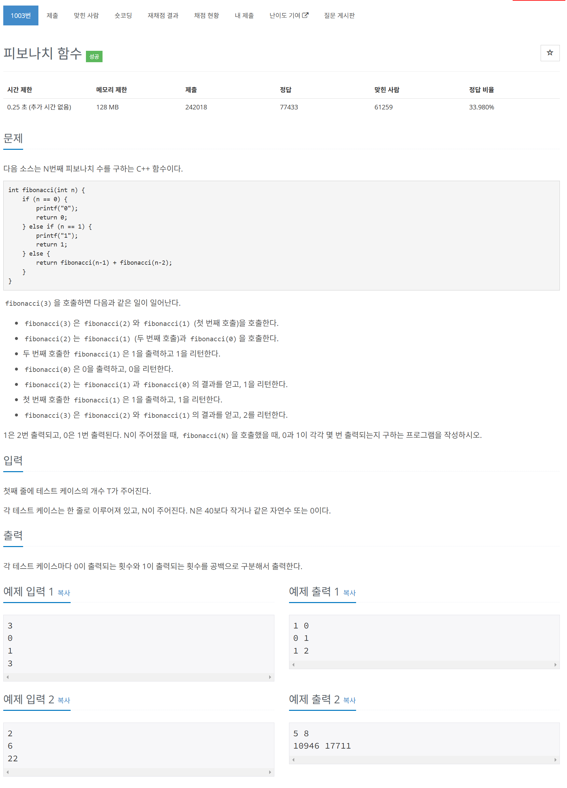

# 문제



# 코드
```
#include <iostream>

int count[40][2];

int getZeroCount(int n) {
  if (n == 0) {
    return count[0][0];
  } else if (n == 1) {
    return count[1][0];
  }
  if (count[n][0] == 0) {
    count[n][0] = getZeroCount(n - 1) + getZeroCount(n - 2);
  }
  return count[n][0];
}

int getOneCount(int n) {
  if (n == 0) {
    return count[0][1];
  } else if (n == 1) {
    return count[1][1];
  }
  if (count[n][1] == 0) {
    count[n][1] = getOneCount(n - 1) + getOneCount(n - 2);
  }
  return count[n][1];
}

int main() 
{
  int T;
  std::cin >> T;
  count[0][0] = 1;
  count[0][1] = 0;
  count[1][0] = 0;
  count[1][1] = 1;
  for (int i = 0; i < T; i++) {
    int n;
    std::cin >> n;
    std::cout << getZeroCount(n) << " " << getOneCount(n) << std::endl;
  }
  return 0;
}
```

# 풀이 과정
시간을 0.25초만 주었기 때문에 엄청 빠른 속도로 해결해야했다.  
이에 무조건 DP로 풀어야한다고 생각하였다.  
0과 1이 호출되는 횟수를 각각 따로 구했다.  