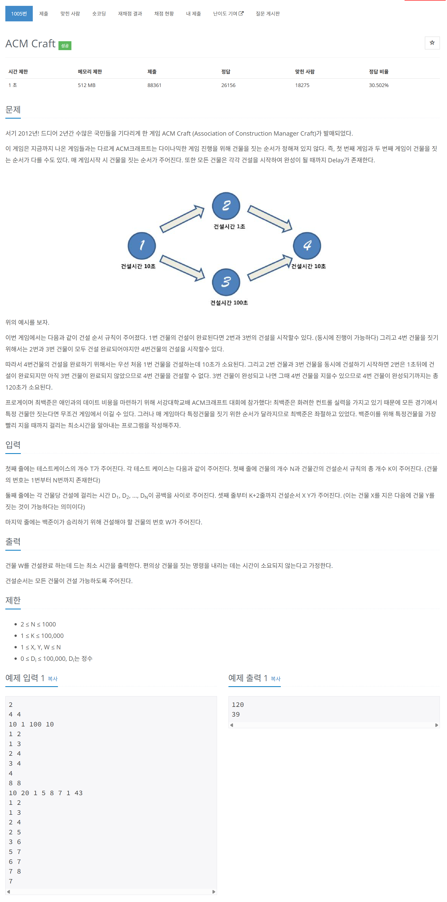

# 문제



# 코드
```
#include <iostream>
#include <vector>
#include <queue>

using namespace std;

int dp[1001];
int indegree[1001];

int main()
{
  ios::sync_with_stdio(false);
  cin.tie(nullptr);

  int T;
  cin >> T;
  for (int t_cnt = 0; t_cnt < T; t_cnt++)
  {
    int N, K;
    cin >> N >> K;
    
    for (int dp_cnt = 0; dp_cnt < N + 1; dp_cnt++)
    {
      dp[dp_cnt] = 0;
      indegree[dp_cnt] = 0;
    }

    vector<int> times_v(N + 1, 0);
    for (int times_cnt = 1; times_cnt <= N; times_cnt++)
    {
      cin >> times_v[times_cnt];
    }    
    
    vector<vector<int> > graph_v_v(N + 1, vector<int>());
    for (int k_cnt = 0; k_cnt < K; k_cnt++)
    {
      int start, end;
      cin >> start >> end;
      graph_v_v[start].push_back(end);
      indegree[end]++;
    }
    queue<int> degree_q;
    for (int i = 1; i < N + 1; i++)
    {
      if (indegree[i] == 0)
      {
        degree_q.push(i);
        dp[i] = times_v[i];
      }
    }


    int Di;
    cin >> Di;
    while (!degree_q.empty())
    {
      int now = degree_q.front();
      degree_q.pop();
      for (int next : graph_v_v[now])
      {
        dp[next] = max(dp[next], dp[now] + times_v[next]);
        indegree[next]--;
        if (indegree[next] == 0)
          degree_q.push(next);
      }
    }
    cout << dp[Di] << "\n";
  }
  return 0;
}
```

# 풀이 과정
위상 정렬과 dp를 이용하여 풀었다.  
작업이 이루어질 순서를 임의로 정렬하여 순서대로 계산하는 것이다.  
점화식은 dp[i + 1] = max(dp[i + 1], dp[i] + times[i + 1])이다.  