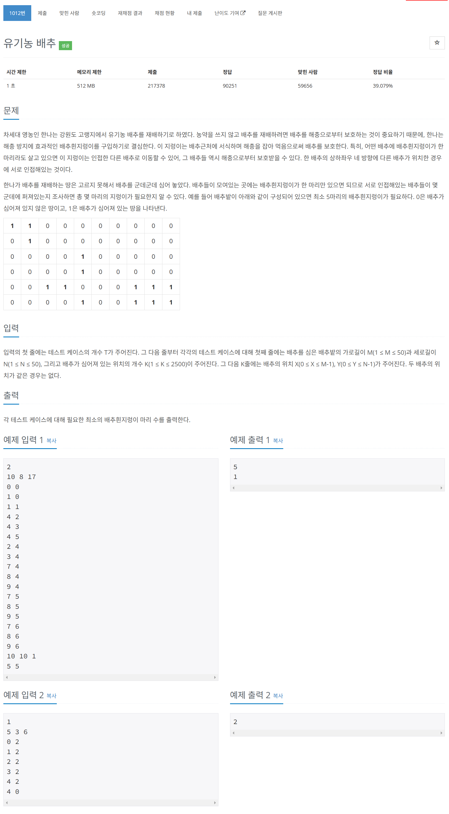

# 문제



# 코드
```
#include <iostream>

void RemoveCabbage(int **land, int x, int y, int col, int row) 
{
    land[x][y] = 0;
    if (x > 0 && land[x - 1][y] == 1)
        RemoveCabbage(land, x - 1, y, col, row);
    if (y > 0 && land[x][y - 1] == 1)
        RemoveCabbage(land, x, y - 1, col, row);
    if (x < col - 1 && land[x + 1][y] == 1)
        RemoveCabbage(land, x + 1, y, col, row);
    if (y < row - 1 && land[x][y + 1] == 1)
        RemoveCabbage(land, x, y + 1, col, row);
}

int main() 
{
  std::ios::sync_with_stdio(false);
  int test_time;
  std::cin >> test_time;
  for (int i = 0; i < test_time; i++)
  {
    int col, row, cabbages;
    std::cin >> col >> row >> cabbages;
    int **land = new int*[col];
    for (int j = 0; j < col; j++)
    {
      land[j] = new int[row];
      for (int k = 0; k < row; k++)
      {
        land[j][k] = 0;
      }
    }
    for (int j = 0; j < cabbages; j++)
    {
      int a, b;
      std::cin >> a >> b;
      land[a][b] = 1;
    }
    int worm = 0;
    for (int x = 0; x < col; x++)
    {
      for (int y = 0; y < row; y++)
      {
        if (land[x][y] != 0)
        {
          worm++;
          RemoveCabbage(land, x, y, col, row);
        }
      }
    }
    std::cout << worm << std::endl;
    for (int j = 0; j < col; j++)
    {
      delete[] land[j];
    }
    delete[] land;
  }
  return 0;
}
```

# 풀이 과정
위에서부터 차례대로 돌면서 처음 배추를 만나면 벌레 수를 증가시키기고  
RemoveCabbage로 넘겨 상하좌우를 살피며 재귀하여 모두 제거하도록 하였다.  
이 과정에서 RemoveCabbage의 조건을 값이 있느냐 없느냐만으로 판단하여  
0보다 큰지를 확인하였는데, runtime error가 발생하였다.  
조건을 좀 더 자세히 풀어 쓰도록 하자.