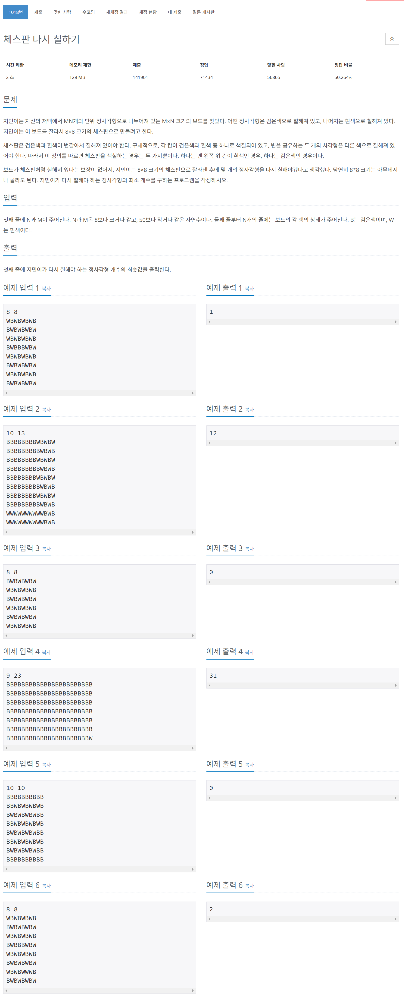

# 문제



# 코드
```
#include <iostream>
#include <string>
#include <algorithm>

std::string black[8] = {
  "BWBWBWBW",
  "WBWBWBWB",
  "BWBWBWBW",
  "WBWBWBWB",
  "BWBWBWBW",
  "WBWBWBWB",
  "BWBWBWBW",
  "WBWBWBWB"
};

std::string white[8] = {
  "WBWBWBWB",
  "BWBWBWBW",
  "WBWBWBWB",
  "BWBWBWBW",
  "WBWBWBWB",
  "BWBWBWBW",
  "WBWBWBWB",
  "BWBWBWBW"
};

int count_diff_string(const std::string& a, const std::string& b) 
{
  int count = 0;
  int length = (a.size() < b.size()) ? a.size() : b.size();
  for (int i = 0; i < length; i++) 
  {
    if (a[i] != b[i]) 
    {
      count++;
    }
  }
  return count;
}

int count_diff_board(const std::string board[50], int x, int y) 
{
  int count_black = 0;
  int count_white = 0;
  for (int i = 0; i < 8; i++) 
  {
    count_black += count_diff_string(board[y + i].substr(x, 8), black[i]);
    count_white += count_diff_string(board[y + i].substr(x, 8), white[i]);
  }
  return std::min(count_black, count_white);
}

int main() 
{
  int n, m;
  std::cin >> n >> m;
  std::string board[50];
  for (int i = 0; i < n; i++) 
  {
    std::cin >> board[i];
  }
  int min_count = 64;
  for (int i = 0; i < n-8+1; i++) 
  {
    for (int j = 0; j < m-8+1; j++) 
    {
      min_count = std::min(min_count, count_diff_board(board, j, i));
    }
  }
  std::cout << min_count << std::endl;
  return 0;
}
```

# 풀이 과정
최대 시간이 43 * 43 * 64 = 약 10만 이었기에  
그냥 일일히 비교해도 되겠다고 생각하였다.  

두 가지의 보드를 만들고  
string 비교시 다른 글자의 개수를 새는 함수를 만들어  
두 가지의 보드와 비교하며 최소 개수를 알아내었다.  
  
# 더 좋은 코드
```
#include <iostream>
#include <vector>
#include <string>
#include <algorithm>

int main() 
{
  int n, m;
  std::cin >> n >> m;
  std::vector<std::string> board(n);
  for (int i = 0; i < n; i++)
    std::cin >> board[i];
  
  int min = 64;
  for (int i = 0; i <= n - 8; i++)
  {
    for (int j = 0; j <= m - 8; j++)
    {
      int cnt1 = 0;
      int cnt2 = 0;
      for (int k = i; k < i + 8; k++)
      {
        for (int l = j; l < j + 8; l++)
        {
          if ((k + l) % 2 == 0)
          {
            if (board[k][l] == 'B')
              cnt1++;
            else
              cnt2++;
          }
          else
          {
            if (board[k][l] == 'W')
              cnt1++;
            else
              cnt2++;
          }
        }
      }
      min = std::min(min, std::min(cnt1, cnt2));
    }
  }
  std::cout << min << std::endl;
  return 0;
}
```
좌표상 격자무늬임을 이용하여 k + l / 2 == 0 인지 아닌지로 비교하였다.  