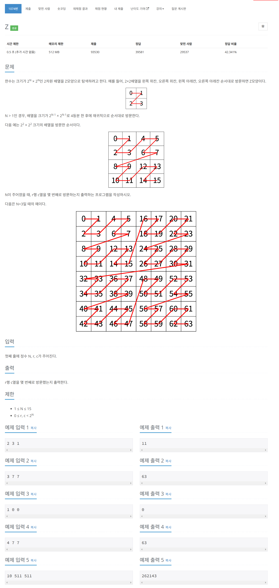

# 문제



# 코드
```
#include <iostream>

int get_result(int n, int r, int c)
{
  int result = 0;
  int size = 1 << (n - 1);
  if (n == 1)
  {
    return 2 * r + c + 1;
  }
  if (r < size && c < size)
  {
    result = get_result(n - 1, r, c);
  }
  else if (r < size && c >= size)
  {
    result = get_result(n - 1, r, c - size) + size * size;
  }
  else if (r >= size && c < size)
  {
    result = get_result(n - 1, r - size, c) + 2 * size * size;
  }
  else if (r >= size && c >= size)
  {
    result = get_result(n - 1, r - size, c - size) + 3 * size * size;
  }
  return result;
}

int main() 
{
  int n, r, c;
  std::cin >> n >> r >> c;
  int result = get_result(n, r, c);
  std::cout << result - 1 << std::endl;
  return 0;
}
```

# 풀이 과정
재귀적으로 몇 사분면에 있는지 판단하면서 들어가는 것이 빠르겠다고 생각했다.  
만약 여기에 넓이는 고정 값인 점을 이용하여 dp까지 이용했다면 더더욱 빠른 코드가 나왔을 것이다.  