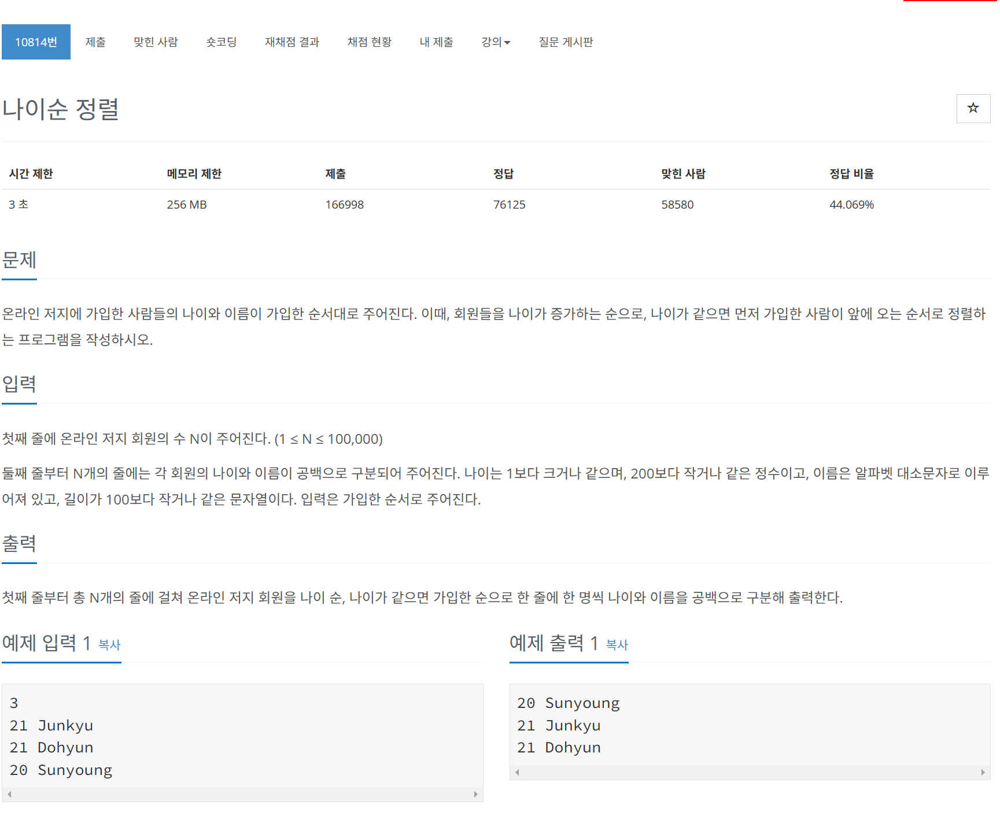

# 문제


# 코드
```
#include <iostream>
#include <vector>
#include <algorithm>

int main() 
{
  int n;
  std::cin >> n;
  std::vector<std::pair<int, std::string>> v(n);
  for (int i = 0; i < n; i++) {
    std::cin >> v[i].first >> v[i].second;
  }
  std::stable_sort(v.begin(), v.end(), [](const std::pair<int, std::string>& a, const std::pair<int, std::string>& b) {
    return a.first < b.first;
  });
  for (int i = 0; i < n; i++) {
    std::cout << v[i].first << ' ' << v[i].second << '\n';
  }
  return 0;
}
```

# 풀이 과정
여기에서는 input 값의 순서도 중요하기 때문에 stable_sort를 사용하였다.  
stable_sort는 merge sort를 사용하기 때문에 input의 순서를 보장 할 수 있다.  
이유는 다음과 같다.  
먼저 분할 된 인풋들을 서로 비교하여 하나씩 담게 되는데,  
이때 같은 값인 두 요소들 중 무조건 왼쪽에 있는 값이 먼저 들어온 값이다.  
따라서 이때는 왼쪽 값을 선택하면 되기에 input의 순서를 보장 할 수 있다.  