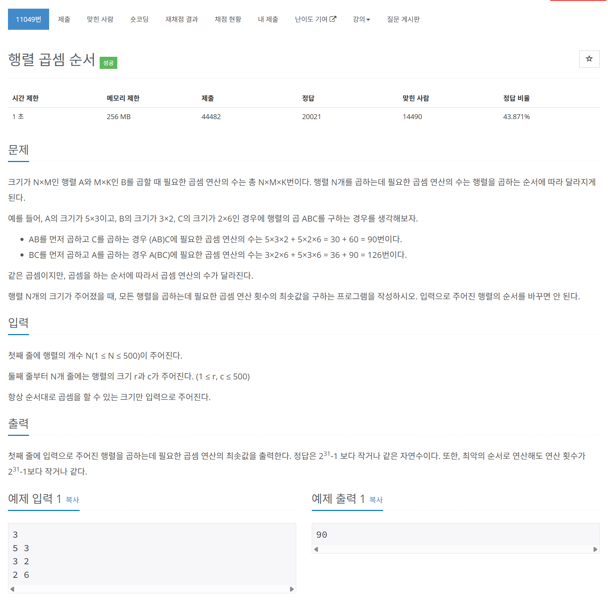

# 문제



# 코드
```
#include <iostream>
#include <vector>

using namespace std;

unsigned int dp[501][501];

unsigned int DP(int start, int end, vector<pair<int, int> >& matrix_v)
{
  if (dp[start][end] != 2147483647)
  {
    return dp[start][end];
  }
  for (int devide = start; devide < end; devide++)
  {
    dp[start][end] = min(dp[start][end], DP(start, devide, matrix_v) + DP(devide + 1, end, matrix_v) + matrix_v[start].first * matrix_v[devide].second * matrix_v[end].second);
  }
  return dp[start][end];
}

int main()
{
  ios::sync_with_stdio(false);
  cin.tie(nullptr);

  int N;
  cin >> N;
  vector<pair<int, int> >matrix_v;
  matrix_v.push_back(make_pair(0, 0));
  for (int i = 0; i < N; i++)
  {
    int r, c;
    cin >> r >> c;
    matrix_v.push_back(make_pair(r, c));
  }
  for (int i = 2; i < N + 1; i++)
  {
    for (int j = 1; j < i; j++)
    {
      dp[j][i] = 2147483647;
    }
  }
  cout << DP(1, N, matrix_v) << "\n";
  return 0;
}
```

# 풀이 과정
동적계획법을 이용하여 풀었다.  