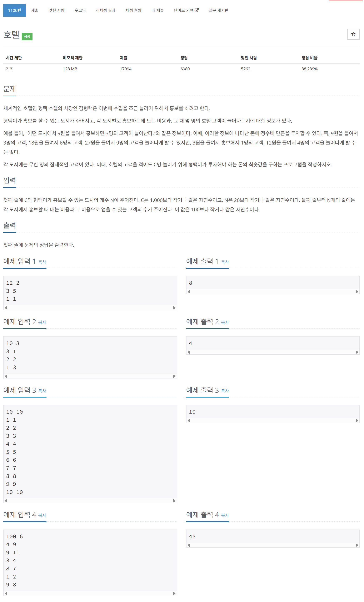

# 문제



# 코드
```
#include <iostream>
#include <vector>

using namespace std;

int total_cost_arr[2000];

int DPCost(vector<int>& cost_v, vector<int>& people_v, int people)
{
  if (people <= 0)
  {
    return 0;
  }
  if (total_cost_arr[people] != 0)
  {
    return total_cost_arr[people];
  }
  total_cost_arr[people] = 2147483647;
  for (int i = 0; i < cost_v.size(); i++)
  {
    total_cost_arr[people] = min(total_cost_arr[people], DPCost(cost_v, people_v, people - people_v[i]) + cost_v[i]);
  }
  return total_cost_arr[people];
}

int main()
{
  int C, N;
  cin >> C >> N;
  vector<int> cost_vector;
  vector<int> people_vector;
  for (int i = 0; i < N; i++)
  {
    int cost, people;
    cin >> cost >> people;
    cost_vector.push_back(cost);
    people_vector.push_back(people);
  }
  cout << DPCost(cost_vector, people_vector, C) << "\n";
  return 0;
}
```

# 풀이 과정
냅섹 알고리즘과 같이 이차원 DP 문제이다.  
정확히 동일하게 풀었다.  