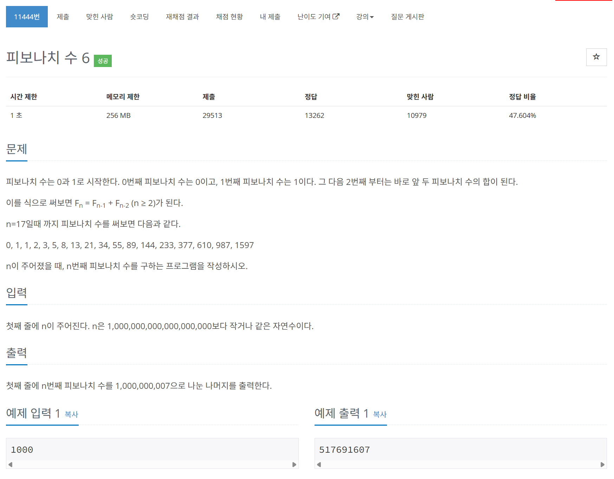

# 문제



# 코드
```
n = int(input())

f_dict = {
    "0": 0,
    "1": 1,
}

def fibonacci(number):
    if str(number) in f_dict:
        return f_dict[str(number)]
    if str(number - 1) in f_dict and str(number - 2) in f_dict:
        f_dict[str(number)] = (f_dict[str(number - 1)] + f_dict[str(number - 2)]) % 1000000007
    elif (number % 2 == 0):
        f_dict[str(number)] = fibonacci(number // 2) * (fibonacci(number // 2 - 1) + fibonacci(number // 2 + 1)) % 1000000007
    else :
        f_dict[str(number)] = (fibonacci(number // 2 + 1) * fibonacci(number // 2 + 1) + fibonacci(number // 2) * fibonacci(number // 2)) % 1000000007
    return f_dict[str(number)]

print(fibonacci(n))
```

# 풀이 과정
O(logN)으로 풀어낼 수 있는 방법이 있어야만 하는 문제였다.  
An = An-1 + An-2에서 An-1항을 An-2 + An-3으로 바꾸어보니  
An = Ax+1 * An-x + Ax * An-x-1이라는 규칙을 발견하였다.  
  
이를 n이 홀수일때와 짝수일때로 나누어 다시 점화식을 세웠다.  
  
파이썬으로 푼 이유는 dictionary가 접근 및 추가 삭제 코드 작성이 훨씬 간편하고,  
다루는 숫자가 int의 범위에 아슬아슬 하여서 간단히 하기 위해이다.  