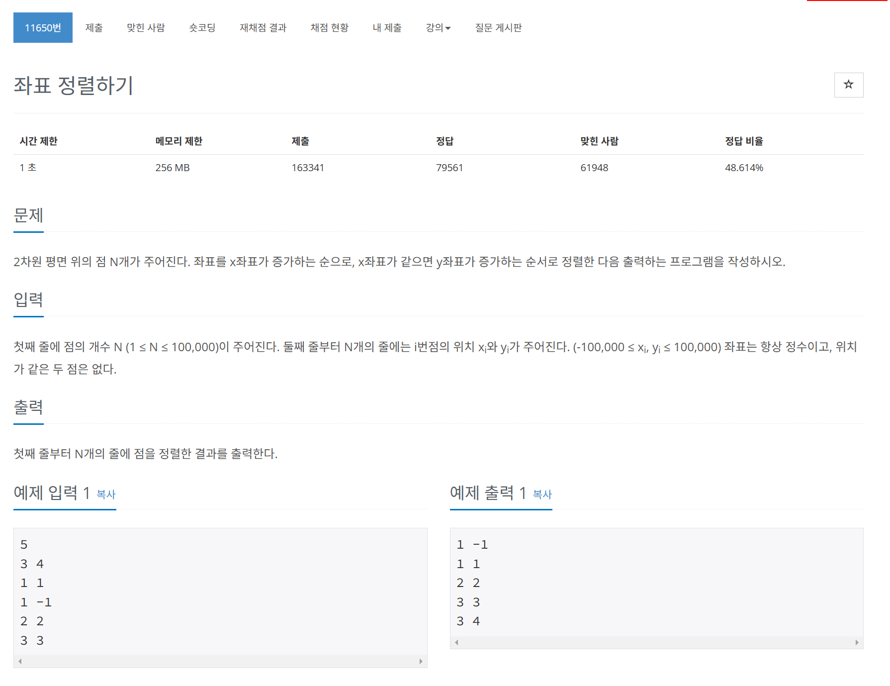

# 문제



# 코드
```
#include <iostream>
#include <vector>
#include <algorithm>

int main() 
{
  int n;
  std::cin >> n;
  std::vector<std::pair<int, int>> v(n);
  for (int i = 0; i < n; i++) {
    std::cin >> v[i].first >> v[i].second;
  }
  std::sort(v.begin(), v.end(), [](const std::pair<int, int>& a, const std::pair<int, int>& b) {
    if (a.first == b.first) {
      return a.second < b.second;
    }
    return a.first < b.first;
  });
  for (int i = 0; i < n; i++) {
    std::cout << v[i].first << ' ' << v[i].second << '\n';
  }
  return 0;
}
```

# 풀이 과정
앞의 값이 같을 때 뒤의 값 순으로  
그렇지 않으면 앞의 값 순으로  
정렬하는 함수를 람다식으로 만들어 주었다.  