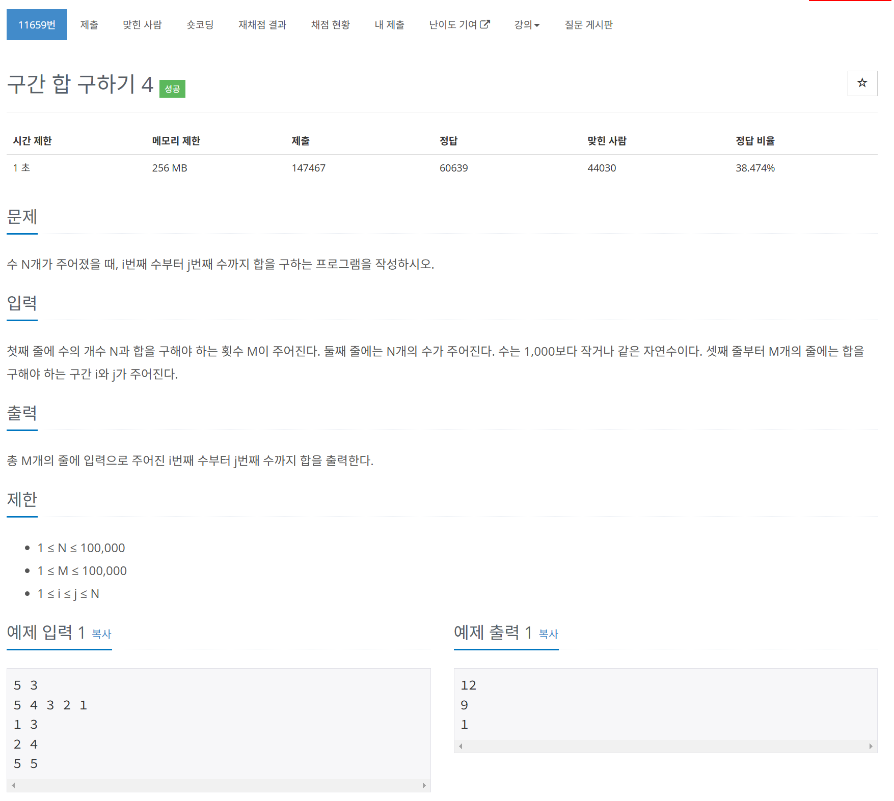

# 문제



# 코드
```
#include <iostream>

int main() 
{
  std::ios_base::sync_with_stdio(false);
  std::cin.tie(NULL);
  std::cout.tie(NULL);
  
  int N, M;
  std::cin >> N >> M;
  int arr[N];
  int prefix_sum[N];
  for (int i = 0; i < N; i++) {
    std::cin >> arr[i];
    if (i == 0) {
      prefix_sum[i] = arr[i];
    } else {
      prefix_sum[i] = prefix_sum[i - 1] + arr[i];
    }
  }
  for (int i = 0; i < M; i++) {
    int start, end;
    std::cin >> start >> end;
    if (start == 1) {
      std::cout << prefix_sum[end - 1] << '\n';
    } else {
      std::cout << prefix_sum[end - 1] - prefix_sum[start - 2] << '\n';
    }
  }
  return 0;
}
```

# 풀이 과정
배열의 길이도 10만이나 될 수 있고, 누적합을 구하는 횟수도 10만회나 될 수 있기에  
무조건 최적화를 해야하는 문제였다.  
그래서 DP가 아닐까 하였지만 구간이 계속 변할 수 있기에 미리 구한 구간의 합은 쓸모 없었다.  
이에 최적화를 할 수 있는 방법을 찾아보니 누적합을 미리 계산해 놓는 방법과 트리를 사용하는 방법이 있었다.  
누적합 배열을 이용하면 최악의 경우 O(1)의 시간이 걸리고 트리를 사용하면 O(logN)만큼의 시간이 걸린다.  
하지만 배열안의 값에 업데이트가 있을 경우 트리는 최악의 경우 업데이트에 O(logN) 배열은 O(N)만큼 걸린다.  
업데이트를 요구하는 문제는 아니었기에 간단히 누적합 배열을 사용하였다.  
  
트리에 관한 내용은 펜윅 트리(또는 binary index tree)와 세그먼트 트리를 알아보길 바란다.  
