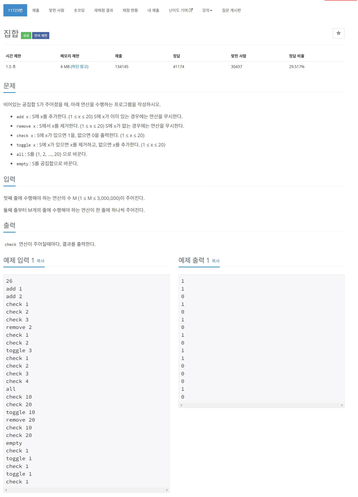

# 문제



# 코드
```
#include <iostream>
#include <bitset>
#include <string>
#include <ios>

class NewSet {
public:
    NewSet() : set() {}

    void add(const int value) {
        set.set(value - 1);
    }

    void remove(const int value) {
        set.reset(value - 1);
    }

    int check(const int value) const {
        return set.test(value - 1);
    }

    void toggle(const int value) {
        set.flip(value - 1);
    }

    void all() {
        set.set();
    }

    void empty() {
        set.reset();
    }

private:
    std::bitset<20> set;
};

int main() {
    std::ios_base::sync_with_stdio(false);
    std::cin.tie(nullptr);
    std::cout.tie(nullptr);

    int command_num;
    std::cin >> command_num;
    NewSet set;

    for (int i = 0; i < command_num; i++) {
        std::string command;
        std::cin >> command;

        int value;
        if (command == "add" || command == "remove" || command == "check" || command == "toggle") {
            std::cin >> value;
        }

        if (command == "add") {
            set.add(value);
        } else if (command == "remove") {
            set.remove(value);
        } else if (command == "check") {
            std::cout << set.check(value) << '\n';
        } else if (command == "toggle") {
            set.toggle(value);
        } else if (command == "all") {
            set.all();
        } else if (command == "empty") {
            set.empty();
        }
    }

    return 0;
}
```

# 풀이 과정
명령어가 3000000줄이나 되기 때문에 이것을 최적화하는 것이 관건인 문제였다.  
c++의 입출력인 cin cout을 stdio와 동기화를 끊어주어야 빠르다는 말을 들었다.  
또한 cin과 cout또 같이 묶여있지 않아야 입려과 출력을 서로 기다리지 않고 빠르게 한다고 한다.  
c++에는 bitset이라는 비트로 이루어진 자료구조가 있어 이러한 문제를 다룰 때 사용하기 좋은 것 같다.  