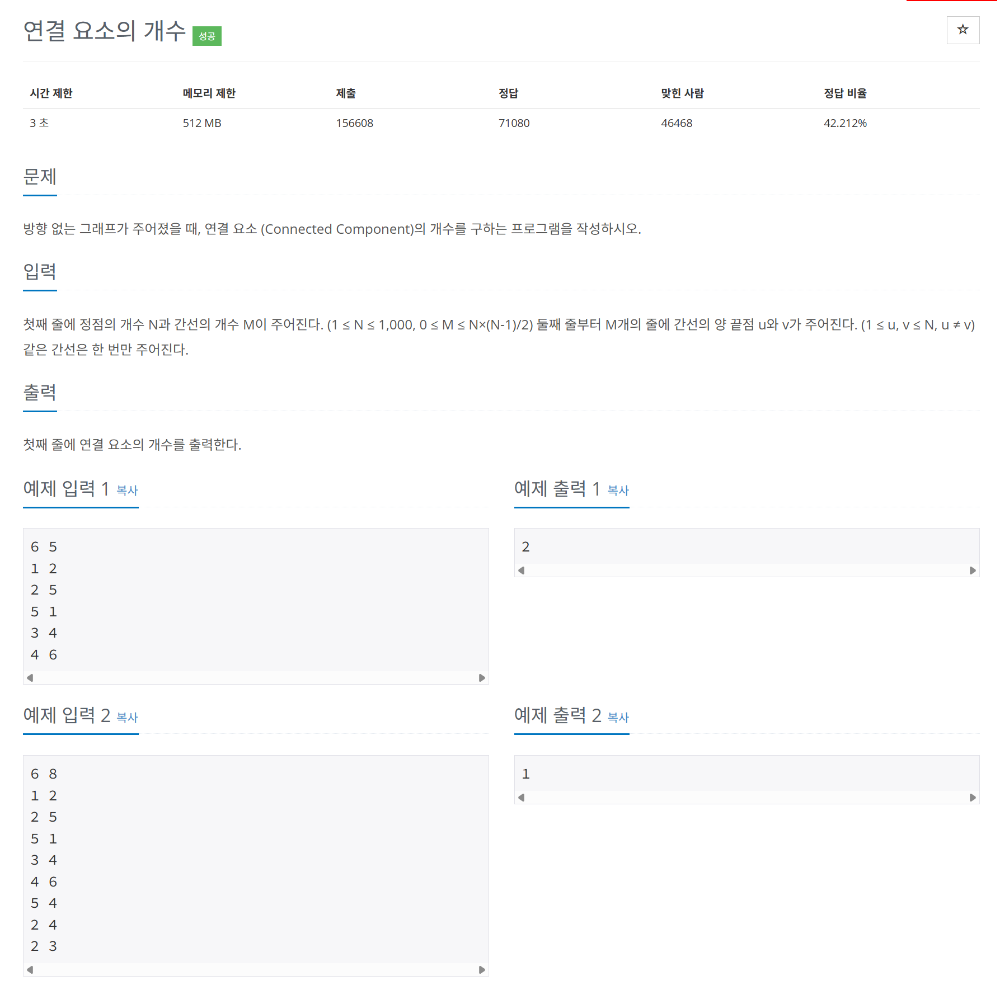

# 문제



# 코드
```
#include <iostream>

void visit_recur(int** graph, int *visited, int index, int limit)
{
  visited[index] = 1;
  for (int i = 0; i <limit; i++)
  {
    if (graph[index][i] == 1 && visited[i] == 0)
    {
      visit_recur(graph, visited, i, limit);
    }
  }
}

int main() 
{
  int N, M;
  std::cin >> N >> M;

  int **graph = new int*[N];
  for (int i = 0; i < N; i++) {
    graph[i] = new int[N];
    for (int j = 0; j < N; j++) {
        graph[i][j] = 0;
    }
  }

  for (int i = 0; i < M; i++)
  {
    int comp1, comp2;
    std:: cin >> comp1 >> comp2;
    graph[comp1 - 1][comp2 - 1] = 1;
    graph[comp2 - 1][comp1 - 1] = 1;
  }

  int visited[N] = {0, };
  int comp_cnt = 0;
  for (int i = 0; i < N; i++)
  {
    if (visited[i] == 0)
    {
      comp_cnt++;
      visit_recur(graph, visited, i, N);
    }
  }

  std::cout << comp_cnt << std::endl;

  for (int i = 0; i < N; i++)
  {
    delete[] graph[i];
  }
  delete[] graph;
  return 0;
}
```

# 풀이 과정
연결 요소란 서로 독립된 그래프들을 이야기한다.  
DFS로 풀었지만 BFS도 같은 시간 복잡도를 가진 문제이다.  