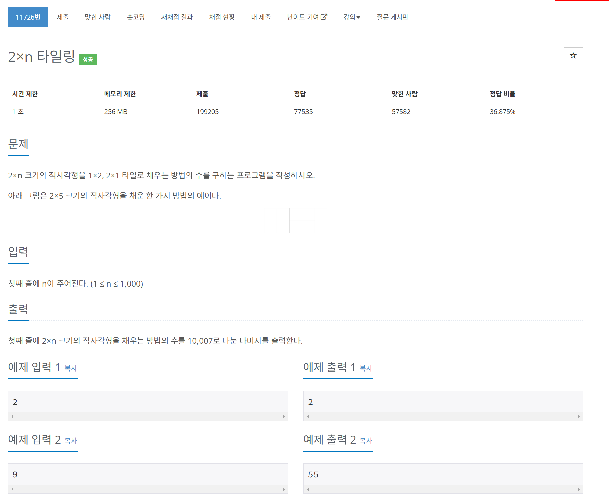

# 문제



# 코드
```
#include <iostream>

int CountWays(int n, int dp[]) {
  if (n == 1) {
    return 1;
  }
  if (n == 2) {
    return 2;
  }
  if (dp[n] != 0) {
    return dp[n];
  }
  dp[n] = (CountWays(n - 1, dp) + CountWays(n - 2, dp)) % 10007;
  return dp[n];
}

int main() {
  int n;
  std::cin >> n;
  int dp[n + 1];
  for (int i = 0; i < n + 1; i++) {
    dp[i] = 0;
  }
  std::cout << CountWays(n,  dp) << std::endl;
  return 0;
}
```

# 풀이 과정
처음에는 1초라길래 dp를 굳이 이용하지 않아도 될 줄 알았으나,  
brute force로 풀게 되면 O(2^n)만큼의 시간이 걸리게 되어 dp를 사용해야 했다.  
피보나치 수열과 비슷한 문제인듯 하다.  