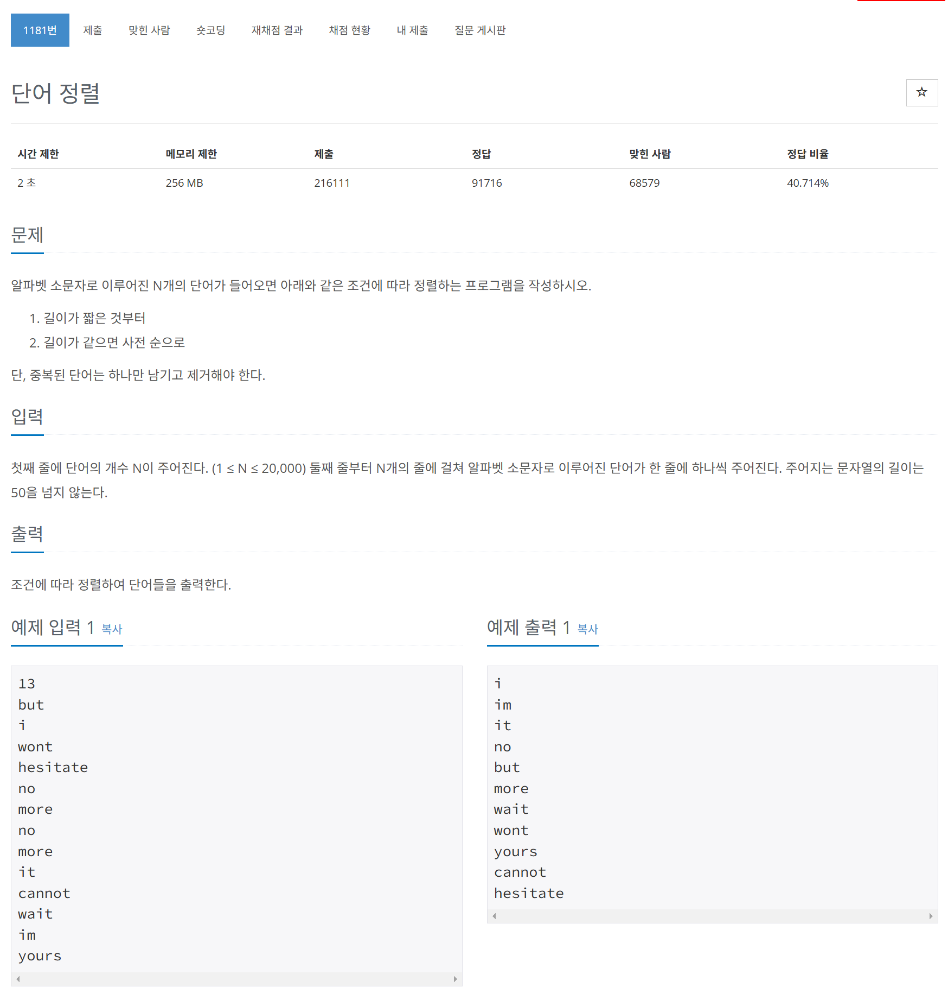

# 문제



# 코드
```
#include <iostream>
#include <string>
#include <vector>
#include <algorithm>


int main()
{
    int n;
    std::cin >> n;

    std::vector<std::string> words(n);
    for (int i = 0; i < n; i++)
    {
      std::cin >> words[i];
    }

    std::sort(words.begin(), words.end(), [](const std::string& a, const std::string& b) {
      if (a.length() == b.length())
        return a < b;
      return a.length() < b.length();
    });

    words.erase(std::unique(words.begin(), words.end()), words.end());

    for (const auto& word : words)
    {
      std::cout << word << std::endl;
    }

    return 0;
}
```

# 풀이 과정
간단한 문제 같아 보였기에 첫 번째 접근에서는 bubble sort를 이용하여 정렬을 하려고 했다.  
그러나 20000개의 입력이 들어올 수 있었고  
bubble sort는 O(n^2)만큼의 시간 복잡도를 갖고 있어 2초라는 시간 안에 충분히 답을 계산해내지 못하였다.  
따라서 더 효율적인 sort 방법을 고민하게 되었는데  
algorithm header file의 vector sort는 quick sort와 다른 여러 sort를 섞어서 사용하여
O(nlogn)의 시간 복잡도를 가지고 있었다.  
```
    std::sort(words.begin(), words.end(), [](const std::string& a, const std::string& b) {
      if (a.length() == b.length())
        return a < b;
      return a.length() < b.length();
    });
```
여기에서 std::sort 함수는 인수로 정렬할 시작지점, 정렬할 끝지점, 정렬기준(함수, 선택)을 받는다.  
이때 정렬 기준으로 람다 함수를 넣어 주었다.  
  
람다 함수는 C++11에서 추가되었다.  
람다는 간단하게 임시 함수를 선언하는 표현식이다.  
C++의 람다 표현식에 대해 살펴보자.  
[]capture list () parameter {} function code  
이렇게 세가지 부분으로 구성된다.  
capture list는 함수 외부의 변수를 캡쳐 할 수 있다.  
[]는 아무 외부 변수도 캡쳐하지 않음  
[=]는 모든 외부 변수를 값으로 캡쳐함  
[&]는 모든 외부 변수를 참조로 캡쳐함  
[x, &y]는 변수 x는 값으로 y는 참조로 캡쳐함을 나타낸다.  
  
또 이후 unique를 통해 중복을 식별하고 erase를 통해 제거하였다.  
erase는 지울 부분의 시작지점과 지울 부분의 끝지점을 매개 변수로 받는다.  
unique는 중복된 요소들을 맨 뒤로 모아둔 뒤 중복된 요소들의 시작 지점을 return한다.  