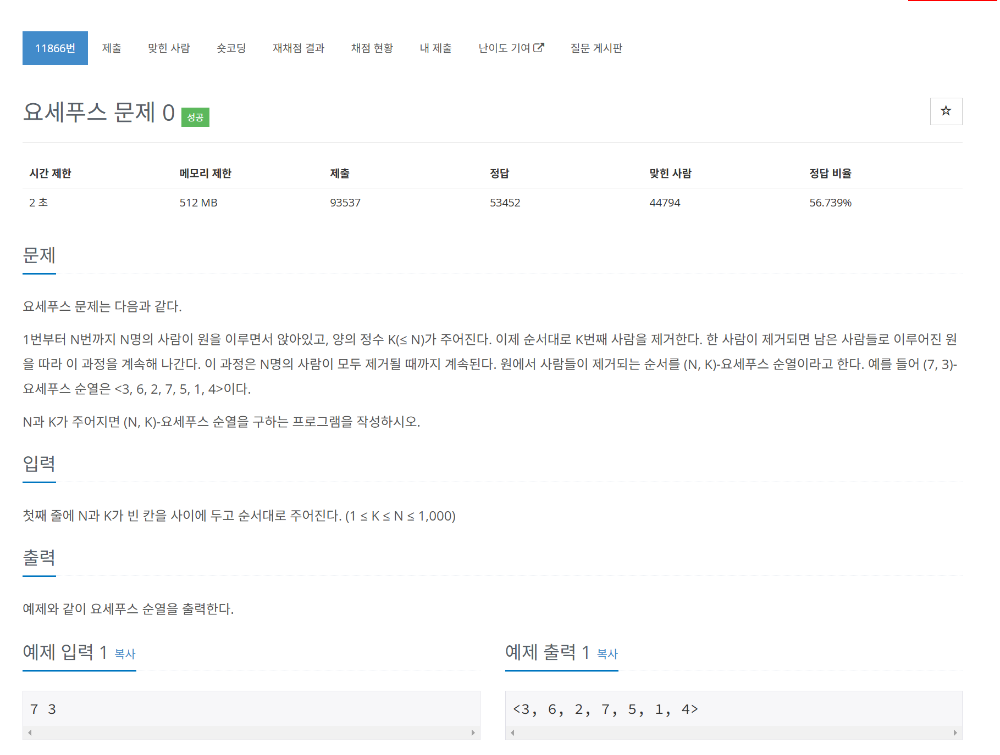

# 문제



# 코드
```
#include <iostream>
#include <vector>
#include <algorithm>

int main() 
{
  int n, k;
  std::cin >> n >> k;
  std::vector<int> v(n);
  for (int i = 0; i < n; i++) {
    v[i] = i + 1;
  }
  std::cout << "<";
  int index = 0;
  while(v.size() >= 1)
  {
    index = (index + k - 1) % v.size();
    if (v.size() == 1) {
      std::cout << v[index];
      v.erase(v.begin() + index);
      break;
    }
    std::cout << v[index] << ", ";
    v.erase(v.begin() + index);
  }
  std::cout << ">";
  return 0;
}
```

# 풀이 과정
index에서 k만큼 이동할 때  
처음 시작은 0에서 시작하므로 index = 0 + (k - 1)  
그 다음은 index가 하나씩 지워져 당겨졌으므로  
index = index + (k - 1)이다.  

# 더 좋은 코드
```
int main() 
{
  int n, k;
  std::cin >> n >> k;
  std::queue<int> q;
  for (int i = 1; i <= n; i++) {
    q.push(i);
  }
  std::cout << "<";
  while(q.size() >= 1)
  {
    for (int i = 0; i < k - 1; i++) {
      q.push(q.front());
      q.pop();
    }
    if (q.size() == 1) {
      std::cout << q.front();
      q.pop();
      break;
    }
    std::cout << q.front() << ", ";
    q.pop();
  }
  std::cout << ">";
  return 0;
}
```
queue를 이용하면 내부의 함수들을 이용하여 좀 더 쉽게 풀 수 있다.