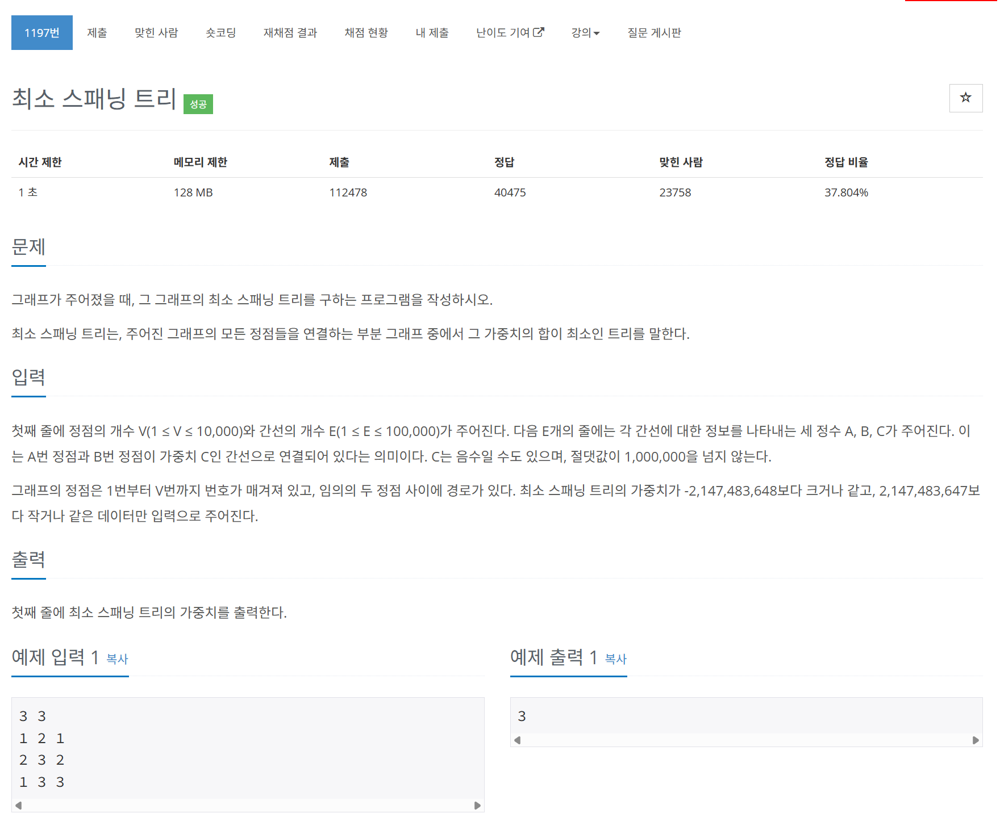

# 문제



# 코드
```
#include <iostream>
#include <tuple>
#include <queue>

using namespace std;

int parent[10001];

//부모 노드 찾는 함수, 재귀적으로 root를 찾게 되어있다.
int find_k(int node)
{
  if (parent[node] == node) //무한 루프 방지
    return node;
  parent[node] = find_k(parent[node]);
  return parent[node];
}

//두 노드를 합하는 함수
bool union_k(int node_a, int node_b)
{
  int parent_a, parent_b;
  parent_a = find_k(node_a);
  parent_b = find_k(node_b);
  if (parent_a != parent_b)
  {
    parent[max(parent_a, parent_b)] = min(parent_a, parent_b); //합칠 때 기준: 작은 노드가 부모가 되도록 연결(반대로 해도 됨)
    return true;
  }
  return false;
}

struct cmp
{
  bool operator()(tuple<int, int, int>& e1, tuple<int, int, int> e2)
  {
    return get<2>(e1) > get<2>(e2);
  }
};


int main()
{
  int V, E;
  cin >> V >> E;
  //priority_queue는 우선순위 큐, cmp를 통해 원하는 식으로 큐의 정렬 기준을 결정.
  priority_queue<tuple<int, int, int>, vector<tuple<int, int, int> >, cmp> edges_queue;
  for (int i = 0; i < E; i++)
  {
    int node1, node2, weight;
    cin >> node1 >> node2 >> weight;
    edges_queue.push(make_tuple(node1, node2, weight));
  }
  //initialize
  for (int i = 0; i <= V; i++) // 모든 노드가 연결되지 않음을 표현하기 위해 자기 자신을 부모로 설정
  {
    parent[i] = i;
  }
  //핵심코드
  int edge_cnt = 0, total_weight = 0;
  while (!edges_queue.empty() && edge_cnt < V - 1) //모든 노드가 한 번 씩만 연결되면 되므로 필요한 간선의 수는 딱 노드 수(V) - 1 개 이다.
  {
    tuple<int, int, int> now_edge = edges_queue.top();
    edges_queue.pop();
    if (union_k(get<0>(now_edge), get<1>(now_edge))) //true일 경우 tree에 연결함
    {
      edge_cnt++;
      total_weight += get<2>(now_edge);
    }
  }
  cout << total_weight << "\n";
  return 0;
}
```

# 풀이 과정
최소 스패닝 트리를 푸는데에는 두 가지의 대표적인 풀이법이 있다.  
크루스칼 알고리즘과 프림 알고리즘이다.  
  
이 풀이는 크루스칼 알고리즘의 예시이다.
  
크루스칼 알고리즘은 모든 간선들을 가중치 순으로 오름차순 정렬하여  
가중치가 최소인 간선으로 연결 해 나가면서  
loop가 생길 때에는 그 간선을 연결하지 않는 식으로 푸는 방법이다.  
  
loop의 판단은 한 간선의 양쪽 끝단의 두 노드들의 부모 노드를 비교하여 만약 같다면  
양쪽의 노드가 이미 같은 트리에 포함되어 있음을 보장하여 판단한다.  
이를 위해서 각각 맨 처음 노드들의 부모를 연결 되지 않은 상태를 표현하기 위해 자기 자신으로 설정하며,  
연결 할 때에 한 방향으로 부모 노드를 찾아가기 위해 연결되는 순서를 만들어주어야 한다.  
이 풀이에서는 크기가 작은 노드가 부모가 되도록 연결하였다.  
  
프림 알고리즘은 그리디 알고리즘이다.  
한 정점에서 시작하여 가장 가중치가 최소인 간선들을 선택해 나간다.  
이 방식으로 풀어보지는 않았지만, 이 방식도 loop를 제거해야만 한다.  
이를 위해서 프림 알고리즘은 visited와 같은 방식을 통해 중복을 방지하는 것 같다.  