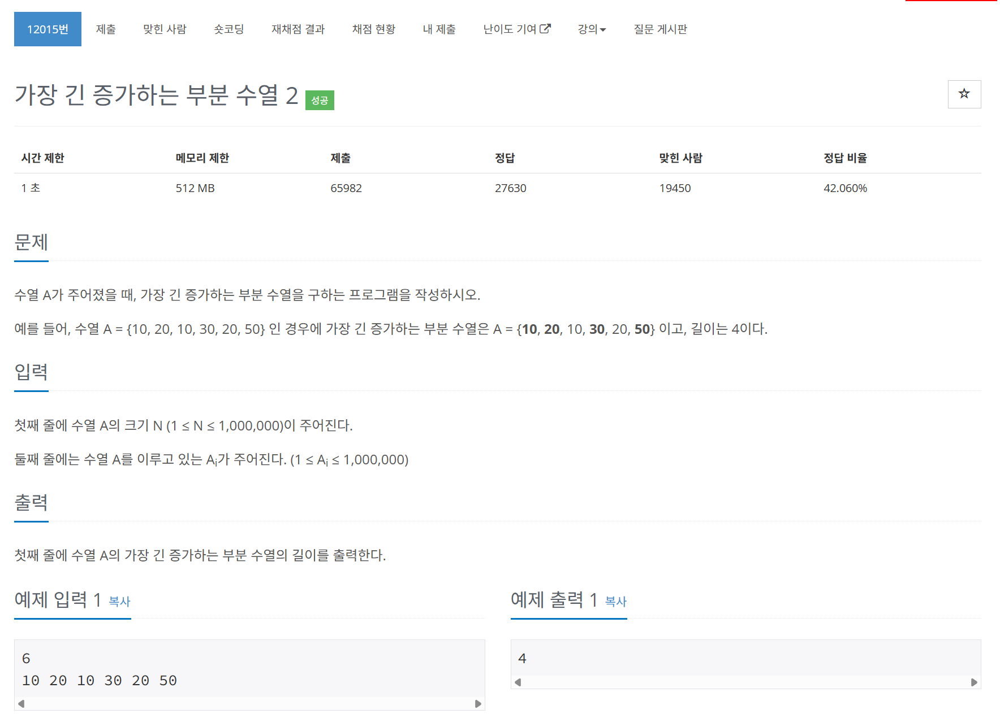

# 문제



# 코드
```
#include <iostream>
#include <vector>

using namespace std;

int lis[1000000];

int main()
{
  ios::sync_with_stdio(false);
  cin.tie(nullptr);

  int N;
  cin >> N;
  vector<int> arr(N, 0);
  for (int i = 0; i < N; i++)
  {
    cin >> arr[i];
  }
  int lis_idx = 0;
  for (int i = 0; i < N; i ++)
  {
    if (lis[lis_idx - 1] >= arr[i])
    {
      //어디 인덱스로 들어갈지 찾기
      int start = 0, end = lis_idx, mid = start + end / 2;
      while (start <= end)
      {
        if (lis[mid] < arr[i])
        {
          start = mid + 1;
        }
        else if (lis[mid] > arr[i])
        {
          end = mid - 1;
        }
        else
        {
          break;
        }
        mid = start + (end - start) / 2;
      }
      lis[mid] = arr[i];
    }
    else
    {
      lis[lis_idx] = arr[i];
      lis_idx++;
    }
  }
  cout << lis_idx << "\n";
  return 0;
}
```

# 풀이 과정
기존의 LIS 알고리즘은 O(N^2)이므로  
100만개의 입력은 1초 안에 처리 불가능하다.  
따라서 어떤 자리에 들어갈지에 대한 탐색을 이분탐색으로 하면  
O(N * logN)이므로 처리 가능하다.  