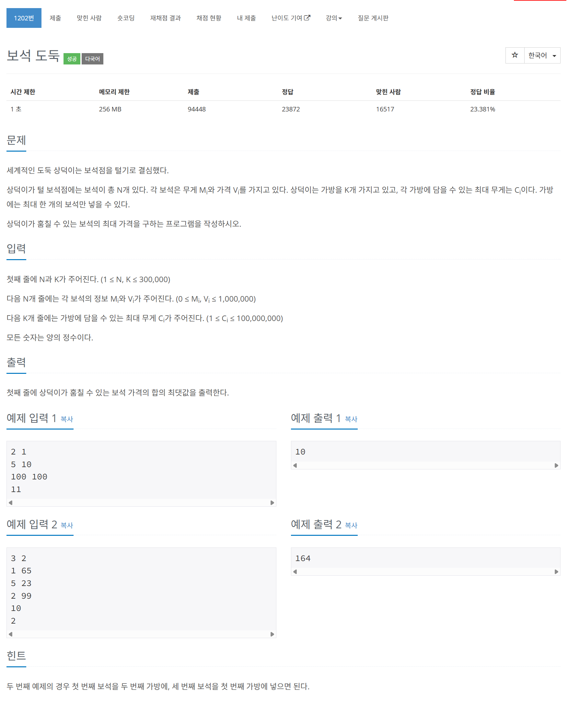

# 문제



# 코드
```
#include <iostream>
#include <queue>
#include <vector>
#include <algorithm>
using namespace std;

struct CMP_s
{
  bool operator()(pair<unsigned int, unsigned int>& a, pair<unsigned int, unsigned int>& b)
  {
    return a.second < b.second;
  }
};

int main()
{
  unsigned int N, K;
  cin >> N >> K;
  vector<pair<unsigned int, unsigned int> > jwels_v(N, pair<unsigned int, unsigned int>(0, 0));
  for (unsigned int i = 0; i < N; i++)
  {
    cin >> jwels_v[i].first >> jwels_v[i].second;
  }
  sort(jwels_v.begin(), jwels_v.end());
  vector<unsigned int> bag_v(K, 0);
  for (unsigned int i = 0; i < K; i++)
  {
    cin >> bag_v[i];
  }
  sort(bag_v.begin(), bag_v.end());
  priority_queue<pair<unsigned int, unsigned int>, vector<pair<unsigned int, unsigned int> >, CMP_s> p_q;
  unsigned long long sum = 0;
  unsigned int jwels_idx = 0;
  for (unsigned int bag : bag_v)
  {
    while (jwels_idx < N && jwels_v[jwels_idx].first <= bag)
    {
      p_q.push(jwels_v[jwels_idx]);
      jwels_idx++;
    }
    if (!p_q.empty() && p_q.top().first <= bag)
    {
      sum += p_q.top().second;
      p_q.pop();
    }
  }
  cout << sum << "\n";
  return 0;
}
```

# 풀이 과정
greedy 알고리즘이다.  
냅섹 알고리즘과 같이 dp 문제일 것 같았지만,  
1억의 배열이 필요한 점 때문에 dp 문제가 아니었다.  
둘 다 무게 순으로 정렬한 뒤  
가방을 순차적으로 돌며 무게 제한 만큼 우선순위 큐에 넣고  
가장 위에 것을 빼 각각 가방에서의 최대 가치 보석을 더한다.  