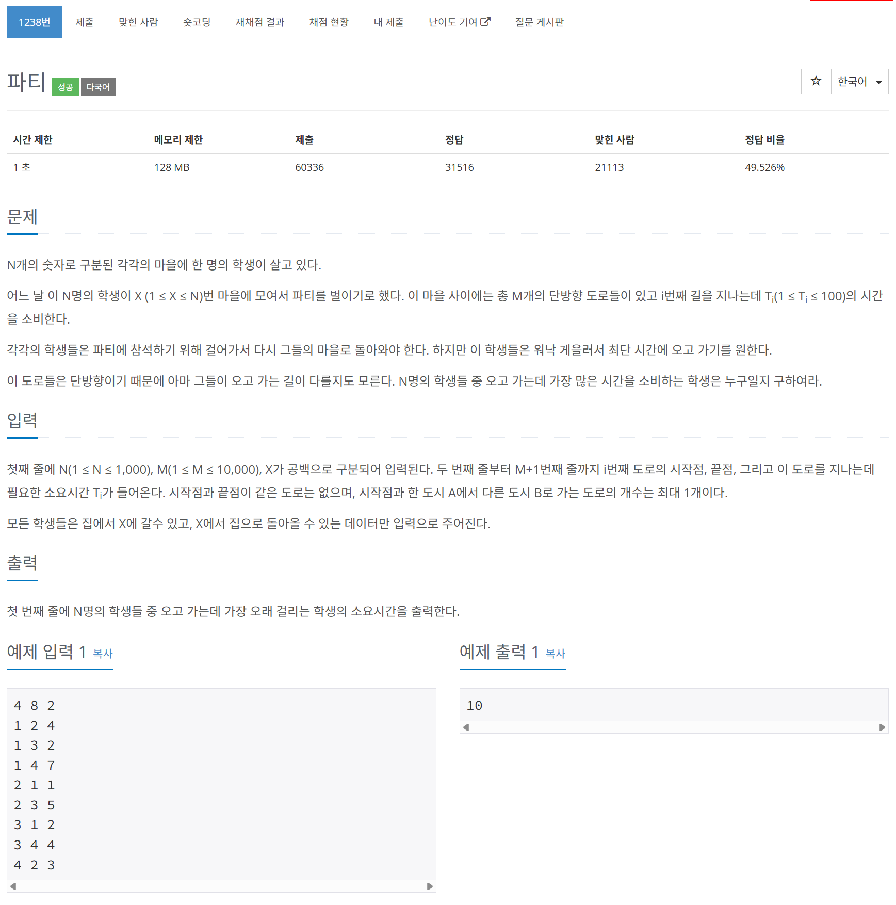

# 문제



# 코드
```
#include <iostream>
#include <vector>
#include <queue>

#define INF 2e9

using namespace std;

class Compare{
  public:
  bool operator()(pair<int, int>& a, pair<int, int>& b) const
  {
    return (a.second > b.second);
  }
};

void Dijkstra(vector<vector<pair<int, int> > >& graph, int root_node, vector<int>& distances)
{
  distances[root_node] = 0;
  distances[0] = 0;
  priority_queue<pair<int, int>, vector<pair<int, int> >, Compare> q_togo;
  q_togo.push(make_pair(root_node, 0));
  while(!q_togo.empty())
  {
    auto [now_node, now_cost] = q_togo.top();
    q_togo.pop();
    for (auto next : graph[now_node])
    {
      auto [next_node, next_cost] = next;
      int new_cost = now_cost + next_cost;
      if (distances[next_node] > new_cost)
      {
        distances[next_node] = new_cost;
        q_togo.push(make_pair(next_node, new_cost));
      }
    }
  }
}

int main() 
{
  int N, M, X; //N: nodes number, M: edges number, X: root node
  cin >> N >> M >> X;
  vector<vector<pair<int, int> > > graph(N + 1); //end cost
  vector<vector<pair<int, int> > > reverse_graph(N + 1); //end cost
  for (int i = 0; i < M; i++)
  {
    int start_node, end_node, cost;
    cin >> start_node >> end_node >> cost;
    graph[start_node].push_back(make_pair(end_node, cost));
    reverse_graph[end_node].push_back(make_pair(start_node, cost));
  }
  vector<int> distances(N + 1, INF);
  vector<int> reverse_distances(N + 1, INF);

  Dijkstra(graph, X, distances);
  Dijkstra(reverse_graph, X, reverse_distances);

  int max = -1;
  for (int i = 1; i < N + 1; i++)
  {
    int total_distance = distances[i] + reverse_distances[i];
    if (total_distance > max)
    {
      max = total_distance;
    }
  }
  cout << max << endl;
  return 0;
}
```

# 풀이 과정
다익스트라를 정방향과 역방향으로 해주면 풀리는 문제이다.