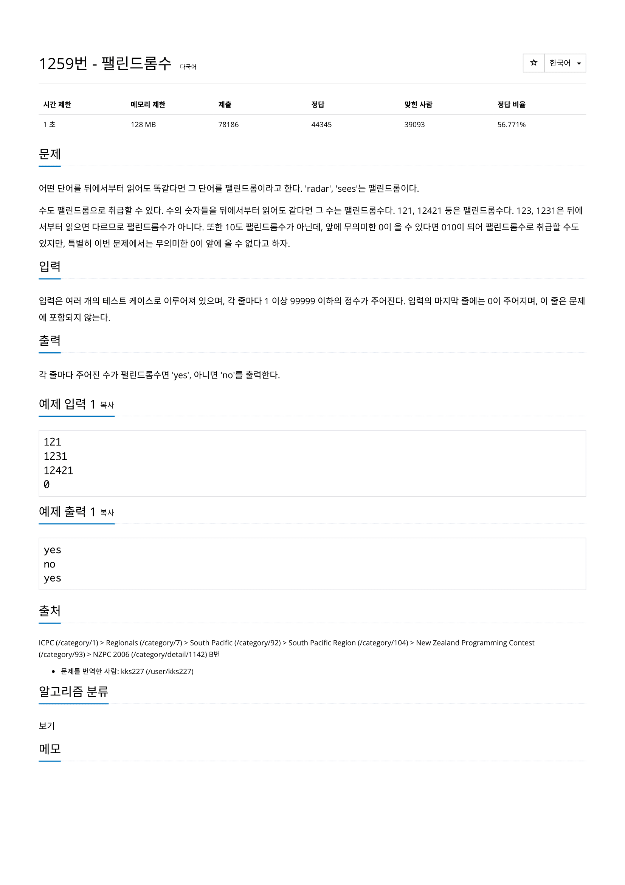

# 문제



# 코드
```
#include <iostream>

int measure_len_num(int num)
{
  int len = 0;
  while(num != 0)
  {
    num /= 10;
    len++;
  }
  return len;
}

bool check_palindrome(int num)
{
  int len, half_len;
  int cnt;
  int temp_num;

  len = measure_len_num(num);
  half_len = len / 2;

  int *array = new int[len];

  for (cnt = 0, temp_num = num; cnt < len ; cnt++)
  {
    array[cnt] = temp_num % 10;
    temp_num /= 10;
  }

  for (cnt = 0; cnt < half_len; cnt++)
  {
    if(array[cnt] != array[len - 1 - cnt])
    {
      delete[] array;
      return false;
    }
  }
  delete[] array;
  return true;
}

int main() 
{
  int num = 0;

  std::cin >> num;
  while (num != 0)
  {
    if (check_palindrome(num))
      std::cout << "yes" << std::endl;
    else
      std::cout << "no" << std::endl;
    std::cin >> num;
  }
  return 0;
}
```

# 더 좋은 코드
```
#include <iostream>

bool check_palindrome(std::string str_num)
{
  int len, half_len;
  int cnt;

  len = str_num.length();
  half_len = len / 2;

  for (cnt = 0; cnt < half_len; cnt++)
  {
    if(str_num[cnt] != str_num[len - 1 - cnt])
    {
      return false;
    }
  }
  return true;
}

int main() 
{
  std::string str_num;

  std::cin >> str_num;
  while (str_num != "0")
  {
    if (check_palindrome(str_num))
      std::cout << "yes" << std::endl;
    else
      std::cout << "no" << std::endl;
    std::cin >> str_num;
  }
  return 0;
}
```
기존의 코드에서 숫자를 받을 때 int로 받았던 것을 str로 바꾸자 번거로움이 많이 줄어들었으며 코드 또한 간결해졌다.