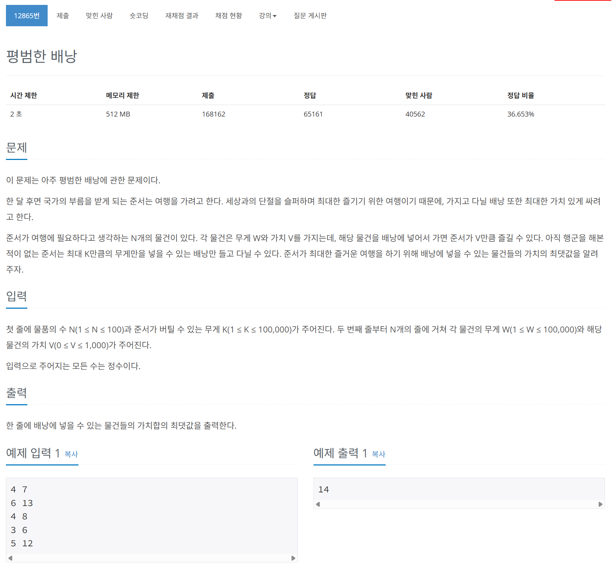

# 문제



# 코드
```
#include <iostream>
#include <vector>

int main()
{
  int N, K;
  std::cin >> N >> K;
  std::vector<int> Weight(N, 0);
  std::vector<int> Value(N, 0);
  for (int i = 0; i < N; i++)
  {
    std::cin >> Weight[i] >> Value[i];
  }
  std::vector<int> dp(K + 1, 0);

  for (int i = 0; i < N; i++)
  {
    for (int j = K; j >= Weight[i]; j--)
    {
      dp[j] = std::max(dp[j], dp[j - Weight[i]] + Value[i]);
    }
  }
  std::cout << dp[K] << std::endl;
  return 0;
}
```

# 풀이 과정
2차원 dynamic programming 문제이다.  
dp는 기존의 문제를 작은 문제들로 분할이 가능한가?  
점화식으로 나타낼 수 있는가?를 통해 풀어내는 문제이다.  
  
하지만 우리가 기존에 생각하던 1차원 점화식으로는 이를 풀어 낼 수 없다.  
물건과 무게 제한이라는 두개의 차원에 영향을 받기 때문이다.  
그래서 이 문제는 2차원 dp로 풀어야 한다.  
  
기본 아이디어는 다음과 같다.  
dp(i, W) = max(dp(i - 1, W), dp(i - 1, W - w(i) + v(i)))  