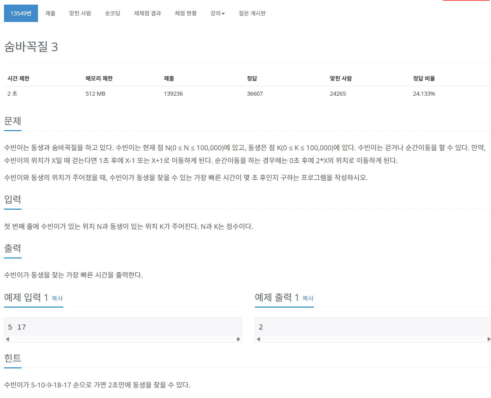

# 문제



# 코드
```
#include <iostream>
#include <queue>
#include <vector>

int main() 
{
  std::priority_queue<std::pair<int, int>, std::vector<std::pair<int, int> >, std::greater<> >position;
  int start, end;
  std::cin >> start >> end;
  std::vector<bool> visited(100001, false);
  position.push(std::make_pair(0, start));
  visited[start] = true;
  int answer;
  while (!position.empty())
  {
    std::pair<int, int> now_pos = position.top();
    position.pop();
    if (now_pos.second == end)
    {
      answer = now_pos.first;
      break;
    }
    if (now_pos.second * 2 <= 100000 && !visited[now_pos.second * 2])
    {
      visited[now_pos.second * 2] = true;
      position.push(std::make_pair(now_pos.first, now_pos.second * 2));
    }
    if (now_pos.second - 1 >= 0 && !visited[now_pos.second - 1])
    {
      visited[now_pos.second  - 1] = true;
      position.push(std::make_pair(now_pos.first + 1, now_pos.second - 1));
    }
    if (now_pos.second + 1 <= 100000 && !visited[now_pos.second + 1])
    {
      visited[now_pos.second + 1] = true;
      position.push(std::make_pair(now_pos.first + 1, now_pos.second + 1));
    }
  }
  std::cout << answer << std::endl;
  return 0;
}
```

# 풀이 과정
넓이 우선 탐색을 하며 이미 다녀온 곳은 visitied를 통해 표시한다.