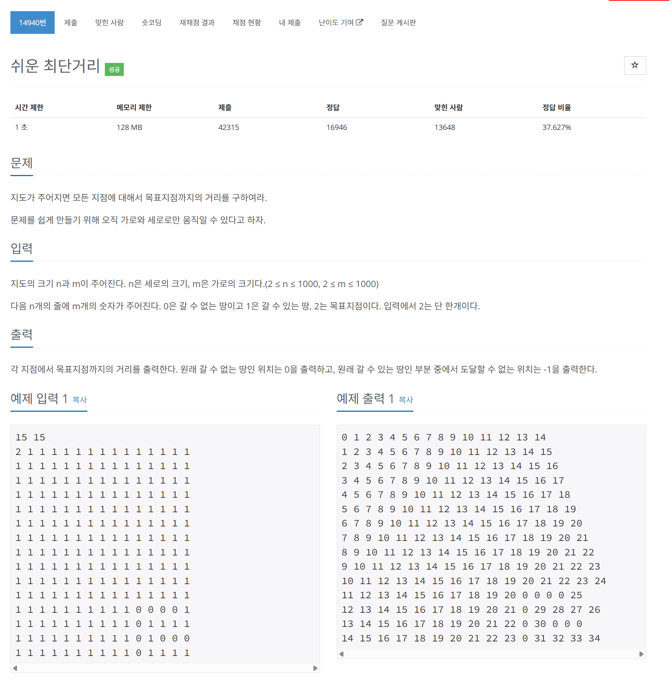

# 문제



# 코드
```
#include <iostream>
#include <vector>
#include <queue>

int main()
{
  int N, M;
  std::cin >> N >> M;
  std::vector<std::vector<int>> vector_map(N, std::vector<int>(M));
  std::vector<std::vector<int>> vector_result(N, std::vector<int>(M, -1));
  std::queue<std::pair<int, int>> queue_to_move;
  for (int i = 0; i < N; i++)
  {
    for (int j = 0; j < M; j++)
    {
      int tmp;
      std::cin >> tmp;
      vector_map[i][j] = tmp;
      if (tmp != 1)
      {
        if (tmp == 2)
        {
          queue_to_move.push({i, j});
        }
        vector_result[i][j] = 0;
      }
    }
  }
  
  int x[4] = {1, -1, 0, 0};
  int y[4] = {0, 0, 1, -1};
  while (!queue_to_move.empty())
  {
    std::pair<int, int> pos_now = queue_to_move.front();
    queue_to_move.pop();
    for (int i = 0; i < 4; i++)
    {
      if ((pos_now.first + y[i] > -1 && pos_now.first + y[i] < N) && (pos_now.second + x[i] > -1 && pos_now.second + x[i] < M) && (vector_result[pos_now.first + y[i]][pos_now.second + x[i]] == -1))
      {
        queue_to_move.push({pos_now.first + y[i], pos_now.second + x[i]});
        vector_result[pos_now.first + y[i]][pos_now.second + x[i]] = vector_result[pos_now.first][pos_now.second] + 1;
      }
    }
  }

  for (int i = 0; i < N; i++)
  {
    for (int j = 0; j < M; j++)
    {
      std::cout << vector_result[i][j] << " ";
    }
    std::cout << std::endl;
  }
  return 0;
}
```

# 풀이 과정
BFS로 풀었다. 중복된 지점을 가지 않도록 하는 부분을 맨 처음 -1로 초기화 하였기에 -1인지 확인하며 가도록 하였다.  
움직일 방향에 대해 x와 y의 변화량을 저장한 배열을 이용하여 풀어보았다.  
이때 내가 움직일 방향이 out_of_range가 발생하지 않을지 validation check를 하는 걸 꼼꼼히 봐야했다.  