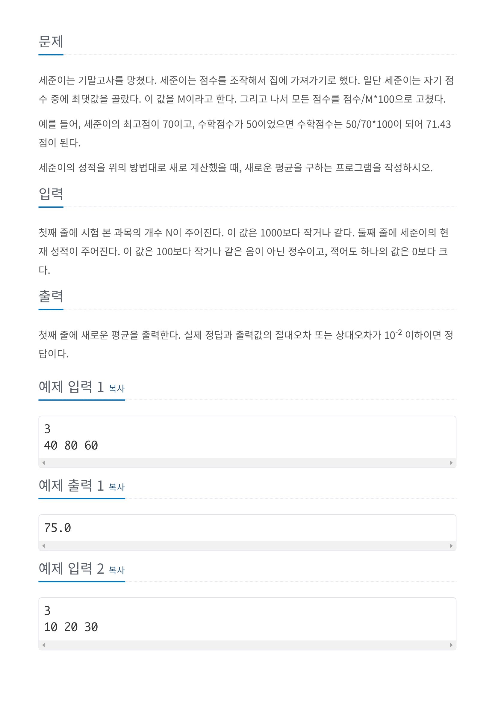
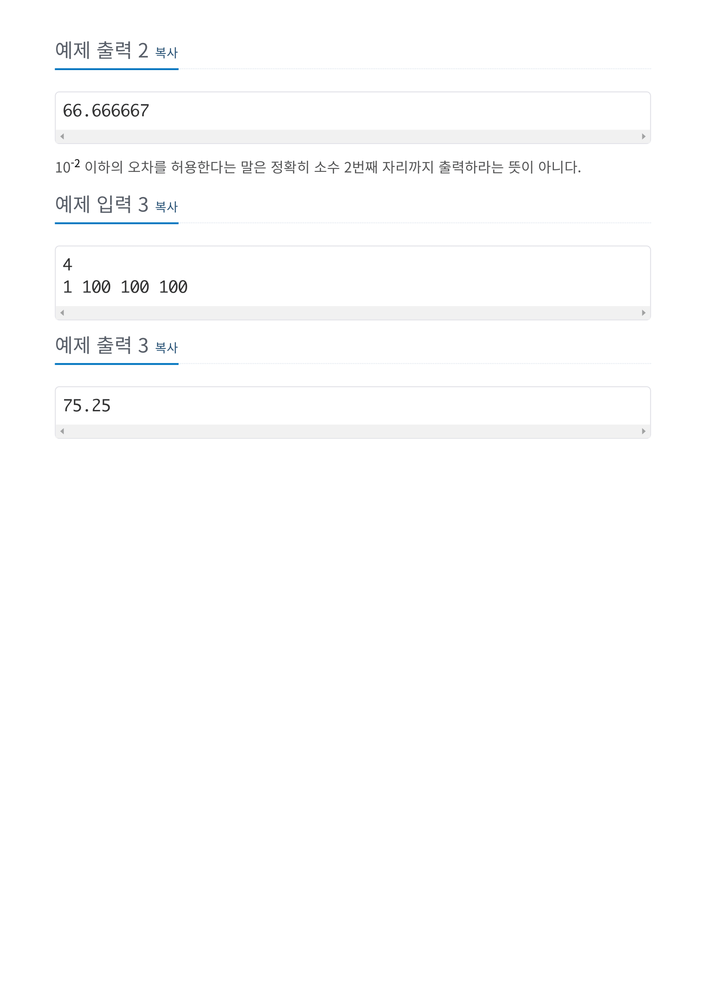

# 문제




# 코드
```
#include <iostream>

double find_max_in_double_arr(double *double_arr, int len)
{
  double max = double_arr[0];
  for (int cnt = 1; cnt < len; cnt++)
  {
    if (max < double_arr[cnt])
      max = double_arr[cnt];
  }
  return max;
}

double *map_new_score(double *score_arr, int max_score, int arr_len)
{
  double *new_score_arr = new double[arr_len];
  for (int cnt = 0; cnt < arr_len; cnt++)
    new_score_arr[cnt] = score_arr[cnt] / max_score * 100;
  return new_score_arr;
}

double find_sum_double_arr(double *double_arr, int len)
{
  double sum = 0;

  for(int cnt = 0; cnt < len; cnt++)
    sum += double_arr[cnt];

  return sum;
}

double find_avg_double_arr(double *double_arr, int len)
{
  return find_sum_double_arr(double_arr, len) / len;
}

int main() 
{
  int subject_num;
  int max_score = 0;

  std::cin >> subject_num;

  double *score = new double[subject_num];

  for (int cnt = 0; cnt < subject_num; cnt++)
    std::cin >> score[cnt];

  max_score = find_max_in_double_arr(score, subject_num);

  double *new_score = map_new_score(score, max_score, subject_num);

  std::cout.precision(10);
  std::cout << find_avg_double_arr(new_score, subject_num) << std::endl;

  delete score;
  delete new_score;
  return 0;
}
```

# 풀이 과정
소수점 둘째자리까지의 오차를 허용한다고 하였는데  
소수점 이하의 출력하는 자릿수를 설정하기 위해서는  
std::cout.precision(출력하는 숫자 개수)를 사용하여 출력 전에 설정해주어야한다.  

# 더 좋은 풀이법
https://st-lab.tistory.com/273  
위 페이지에서는 배열을 사용하는 방법과 사용하지 않는 방법에 대해 다루고 있다.  
  
그중 배열을 사용하는 방법에서는 algorithm 헤더파일을 include하여 배열을 정렬하고  
이 때 맨 마지막에 오는 값이 최대임을 활용하여 쉽게 풀어내었다.  
  
배열을 사용하지 않는 방법에서는 매 입력마다 입력 값이 최댓값인지 판단하고 누적합을 계산하여   풀어내었다.  