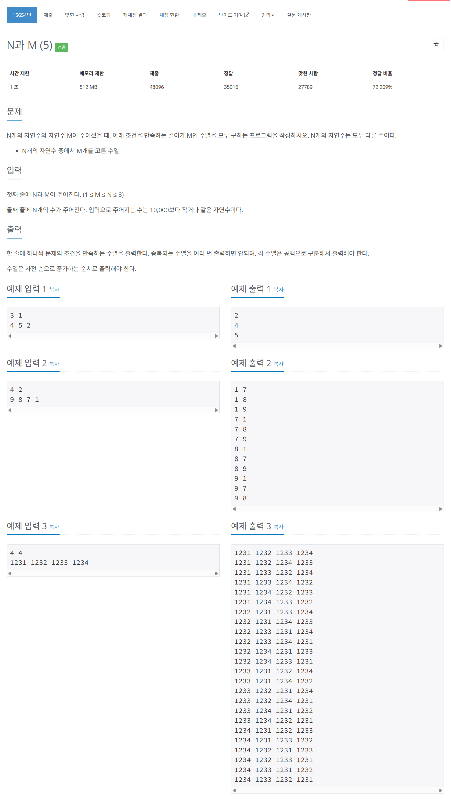

# 문제



# 코드
```
#include <iostream>
#include <vector>
#include <algorithm>

void NMProblem(int N, int M, std::vector<int> &nums, std::vector<bool> &visited, std::vector<int> &buffer, std::vector<std::vector<int>> &result)
{
  if (buffer.size() == M)
  {
    result.push_back(buffer);
    return;
  }
  for (int i = 0; i < N; i++)
  {
    if (!visited[i])
    {
      buffer.push_back(nums[i]);
      visited[i] = true;
      NMProblem(N, M, nums, visited, buffer, result);
      buffer.pop_back();
      visited[i] = false;
    }
  }
}

int main()
{
  std::ios::sync_with_stdio(false);
  std::cin.tie(NULL);

  int N, M;
  std::cin >> N >> M;
  std::vector<int> nums(N);
  std::vector<bool> visited(N, false);
  for (int i = 0; i < N; i++)
  {
    std::cin >> nums[i];
  }
  std::sort(nums.begin(), nums.end());
  std::vector<int> buffer;
  std::vector<std::vector<int>> result;
  NMProblem(N, M, nums, visited, buffer, result);
  for (auto v: result)
  {
    for (auto n: v)
    {
      std::cout << n << " ";
    }
    std::cout << "\n";
  }
  return 0;
}
```

# 풀이 과정
출력이 많으면 std::ios::sync_with_stdio(false);와 std::cin.tie(NULL);이 들어가는게 c++의 한계인가 싶다.  
visited를 통해 방문했는지 안했는지 확실히 판단하도록 하였다.  
또 result를 통해 한 번에 출력하였다.  
vector을 parameter로 function에 넘겨주기 위해서는 call by reference를 해야한다.  