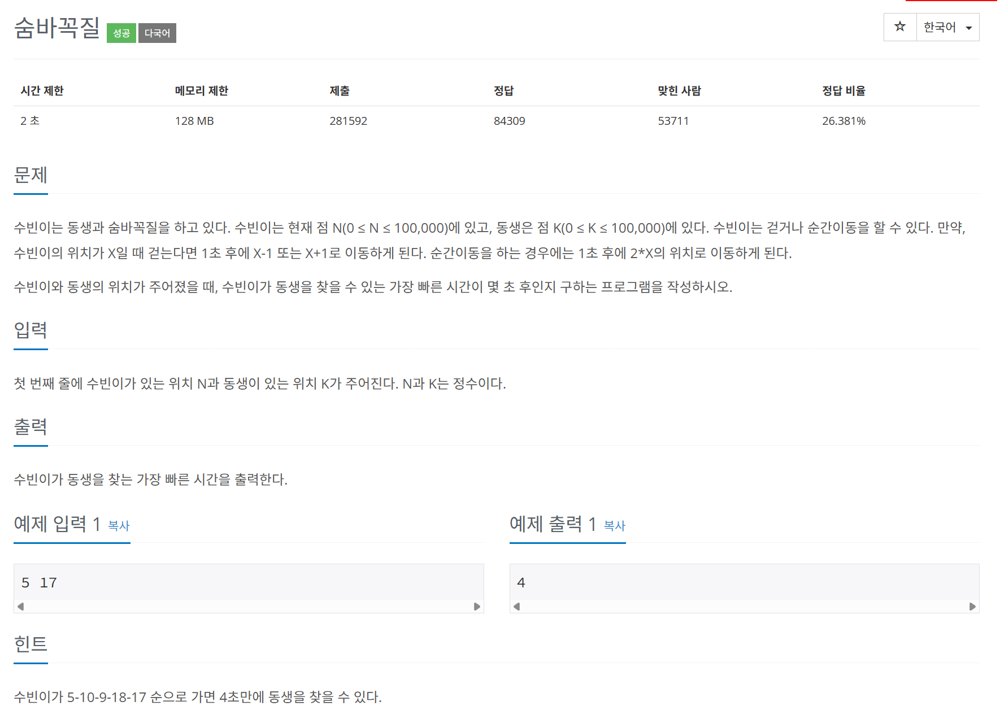

# 문제



# 코드
```
#include <iostream>
#include <vector>

int MoveMultiple(int pos)
{
  if (pos <= 50000)
  {
    return (pos * 2);
  }
  return -1;
}

int MovePlus(int pos)
{
  if (pos < 100000)
  {
    return (pos + 1);
  }
  return -1;
}

int MoveMinus(int pos)
{
  return (pos - 1);
}

int BFSGetLeastMove(int arr[100001], int start, int end, int (*MvFunc[3])(int))
{
  if (start == end)
    return 0;
  int mv_cnt = 0;
  int mv_cnt_arr[100001] = {0, };
  std::vector<std::vector<int>> pos_vector_pool;
  std::vector<int> inital_move_pos;
  inital_move_pos.push_back(start);
  pos_vector_pool.push_back(inital_move_pos);
  while (1)
  {
    mv_cnt++;
    std::vector<int> v;
    pos_vector_pool.push_back(v);
    for (int pos : pos_vector_pool[mv_cnt - 1])
    {
      for (int i = 0; i < 3; i++)
      {
        int temp = MvFunc[i](pos);
        if (temp >= 0 && temp <= 100000)
        {
          if (mv_cnt_arr[temp] == 0)
          {
            if (temp == end)
            {
              return mv_cnt;
            }
            mv_cnt_arr[temp] = mv_cnt;
            pos_vector_pool[mv_cnt].push_back(temp);
          }
        }
      }
    }
  }
}

int main() 
{
  int N, K;
  std::cin >> N >> K;
  int arr[100001] = {0, };
  int (*MvFunc[3])(int);
  MvFunc[0] = MoveMultiple;
  MvFunc[1] = MovePlus;
  MvFunc[2] = MoveMinus;
  std::cout << BFSGetLeastMove(arr, N, K, MvFunc) << std::endl;
  return 0;
}
```

# 풀이 과정
처음에는 DP로 접근하여 깊이 우선 탐색을 하려고 하였다.  
그러나 한 지점에 대한 깊이 우선 탐색 결과를 저장할 때 문제가 생겼다.  
한 지점에 도달한 시점에서 움직임 횟수가 최소인지 모른다는 것이다.  
따라서 한 지점에 도달 할 때마다 이 값이 최소인지 이미 저장된 값과 비교하여 다시 저장해주어야한다.  
그렇다면 DP의 최대 장점인 이미 한 번 계산한 값을 다시 구하지 않고 저장하여 사용함을 이용할 수 없었다.  
  
따라서 이 문제는 넓이 우선 탐색으로 접근하여야 한다.
그런데 queue를 이용하여 다음 이동할 pos를 저장하려 했는데  
계속 다음 이동 장소를 queue에 넣어주면 언제 mvcnt를 하나 올려서 저장해야 하는지 감을 잡지 못했다.  
그래서 최적화 되지 못한 코드를 작성했다.  
  
# 더 좋은 코드
```
#include <iostream>
#include <queue>
#include <vector>
using namespace std;

int BFS(int start, int end) {
    if (start == end) {
        return 0; // 수빈이와 동생이 같은 위치에 있으면 이동할 필요가 없음
    }

    const int MAX = 100000;
    vector<bool> visited(MAX + 1, false); // 방문 여부 확인 배열
    queue<pair<int, int>> q; // pair의 첫 번째는 위치, 두 번째는 시간
    q.push({start, 0});
    visited[start] = true;

    while (!q.empty()) {
        int pos = q.front().first;
        int time = q.front().second;
        q.pop();

        // 3가지 이동 방식 처리
        int next_positions[] = {pos - 1, pos + 1, pos * 2};
        for (int next_pos : next_positions) {
            if (next_pos >= 0 && next_pos <= MAX && !visited[next_pos]) {
                if (next_pos == end) {
                    return time + 1; // 동생을 찾으면 최단 시간 반환
                }
                q.push({next_pos, time + 1});
                visited[next_pos] = true;
            }
        }
    }
    return -1; // 동생을 찾을 수 없는 경우 (문제의 조건상 발생하지 않음)
}

int main() {
    int N, K;
    cin >> N >> K;
    cout << BFS(N, K) << endl;
    return 0;
}
```
chat gpt는 이를 pair을 저장하는 queue와 visited_vector을 이용해 풀이하였다.  