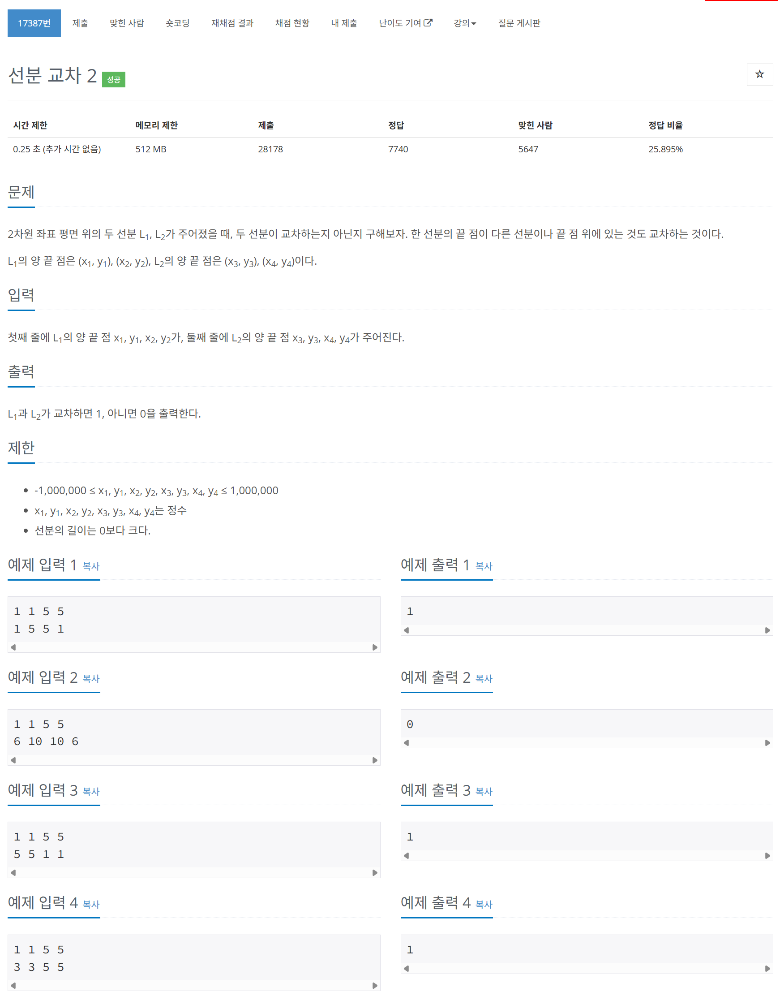

# 문제



# 코드
```
#include <iostream>
#include <vector>

using namespace std;

long long getCrossProduct(int x1, int y1, int x2, int y2)
{  
  return ((long long)x1 * y2 - (long long)x2 * y1);
}

int CCW(int x1, int y1, int x2, int y2, int x3, int y3)
{
  long long result = getCrossProduct(x2 - x1, y2 - y1, x3 - x1, y3 - y1);
  if (result == 0)
  {
    return 0;
  }
  else if (result > 0)
  {
    return 1;
  }
  else
  {
    return -1;
  }
}

bool isInLine(int start_x, int start_y, int end_x, int end_y, int point_x, int point_y)
{
  int min_x = min(start_x, end_x);
  int max_x = max(start_x, end_x);
  int min_y = min(start_y, end_y);
  int max_y = max(start_y, end_y);
  if ((start_x == point_x && start_y == point_y) || (end_x == point_x && end_y == point_y))
  {
    return true;
  }
  if (start_x == end_x && end_x == point_x)
  {
    //x가 모두 같으면 y로 판단
    if (min_y < point_y && max_y > point_y)
    {
      return true;
    }
  }
  if (start_y == end_y && end_y == point_y)
  {
    //y가 모두 같으면 x로 판단
    if (min_x < point_x && max_x > point_x)
    {
      return true;
    }
  }
  if ((min_y < point_y && max_y > point_y) && (min_x < point_x && max_x > point_x))
  {
    return true;
  }
  return false;
}

bool isMeetByPosition(int x1, int y1, int x2, int y2, int x3, int y3, int x4, int y4)
{
  if (isInLine(x1, y1, x2, y2, x3, y3))
  {
    return true;
  }
  else if (isInLine(x1, y1, x2, y2, x4, y4))
  {
    return true;
  }
  else if (isInLine(x3, y3, x4, y4, x1, y1))
  {
    return true;
  }
  return false;
}

bool isMeet(int x1, int y1, int x2, int y2, int x3, int y3, int x4, int y4)
{
  int firstCCW = CCW(x1, y1, x2, y2, x3, y3);
  int secondCCW = CCW(x1, y1, x2, y2, x4, y4);
  int thirdCCW = CCW(x3, y3, x4, y4, x1, y1);
  int fourthCCW = CCW(x3, y3, x4, y4, x2, y2);

  if (firstCCW == 0 && secondCCW == 0 && thirdCCW == 0 && fourthCCW == 0)
  {
    return (isMeetByPosition(x1, y1, x2, y2, x3, y3, x4, y4));
  }
  else if (firstCCW * secondCCW <= 0 && thirdCCW * fourthCCW <= 0)
  {
    return true;
  }
  return false;
}

int main()
{
  vector<pair<pair<int, int>, pair<int, int> > > pos_v(2, pair<pair<int, int>, pair<int, int>>(pair<int, int>(0, 0), pair<int, int>(0, 0)));
  for (int i = 0; i < 2; i++)
  {
    cin >> pos_v[i].first.first >> pos_v[i].first.second >> pos_v[i].second.first >> pos_v[i].second.second;
  }
  cout << isMeet(pos_v[0].first.first, pos_v[0].first.second, pos_v[0].second.first, pos_v[0].second.second, pos_v[1].first.first, pos_v[1].first.second, pos_v[1].second.first, pos_v[1].second.second) << "\n";
  return 0;
}
```

# 풀이 과정
먼저 세 점이 어떤 위상에 있는지를 판단하는 CCW라는 알고리즘부터 알아야 한다.  
한 점을 원점으로 잡고 이 점에서 각 두 점으로의 벡터를 만들면  
우리는 이 두 벡터를 외적 할 수 있다.  
그리고 그 외적 값을 통해 이 세 점이 시계 방향으로 존재하는지 시계 반대 방향으로 존재하는지를 판별 할 수 있다.  
  
이때 두 선분이 서로 교차하게 되면 한 끝 점이 다른 선분의 일직선 상에 놓여있지 않을 경우  
한 선분에서의 다른 선분의 양 끝점과의 외적은 하나는 양수 하나는 음수 값이 된다.  
이를 통해 교차를 판별할 수 있다.  
  
하지만 일직선 상에 놓여있을 경우 외적 값은 0이 된다.  
따라서 모든 점이 일직선 상에 놓여있을 경우를 따로 교차하는지 판별해주어야 한다.  


# 더 좋은 코드
```
#include <iostream>
#include <algorithm> // min, max, swap 함수 사용

using namespace std;

// 점의 좌표를 관리하는 구조체
struct Point {
    long long x, y;

    // 점을 비교하기 위한 연산자 (x좌표 먼저, 같으면 y좌표 비교)
    bool operator<=(const Point& p) const {
        if (x == p.x) {
            return y <= p.y;
        }
        return x <= p.x;
    }
};

// 세 점의 방향성을 알려주는 CCW 함수
int ccw(Point p1, Point p2, Point p3) {
    // 신발끈 공식을 이용한 외적 계산 (long long으로 안전하게)
    long long result = (p2.x - p1.x) * (p3.y - p1.y) - (p3.x - p1.x) * (p2.y - p1.y);

    if (result > 0) return 1;      // 반시계
    if (result < 0) return -1;     // 시계
    return 0;                      // 일직선
}

int main() {
    ios_base::sync_with_stdio(false);
    cin.tie(NULL);

    // 점 P1, P2 (선분 L1), P3, P4 (선분 L2)
    Point p1, p2, p3, p4;
    cin >> p1.x >> p1.y >> p2.x >> p2.y;
    cin >> p3.x >> p3.y >> p4.x >> p4.y;

    // 각 선분에 대해 CCW 값 계산
    int ccw123 = ccw(p1, p2, p3);
    int ccw124 = ccw(p1, p2, p4);
    int ccw341 = ccw(p3, p4, p1);
    int ccw342 = ccw(p3, p4, p2);

    // 기본 교차 판별: 각 선분을 기준으로 다른 선분의 양 끝점이 서로 다른 방향에 있는가
    bool general_intersect = (long long)ccw123 * ccw124 <= 0 && (long long)ccw341 * ccw342 <= 0;

    // 모든 점이 일직선 상에 있는 특수 케이스 처리
    if (ccw123 == 0 && ccw124 == 0 && ccw341 == 0 && ccw342 == 0) {
        // 각 선분의 양 끝점을 정렬
        if (p2.x < p1.x || (p2.x == p1.x && p2.y < p1.y)) swap(p1, p2);
        if (p4.x < p3.x || (p4.x == p3.x && p4.y < p3.y)) swap(p3, p4);
        
        // 두 선분의 범위가 겹치는지 확인
        if (p1 <= p4 && p3 <= p2) {
            cout << 1 << "\n";
        } else {
            cout << 0 << "\n";
        }
    } 
    // 기본 교차 케이스
    else if (general_intersect) {
        cout << 1 << "\n";
    } 
    // 교차하지 않는 케이스
    else {
        cout << 0 << "\n";
    }

    return 0;
}
```

점들을 정렬해서 간단히 확인 한 부분이 인상적이다.