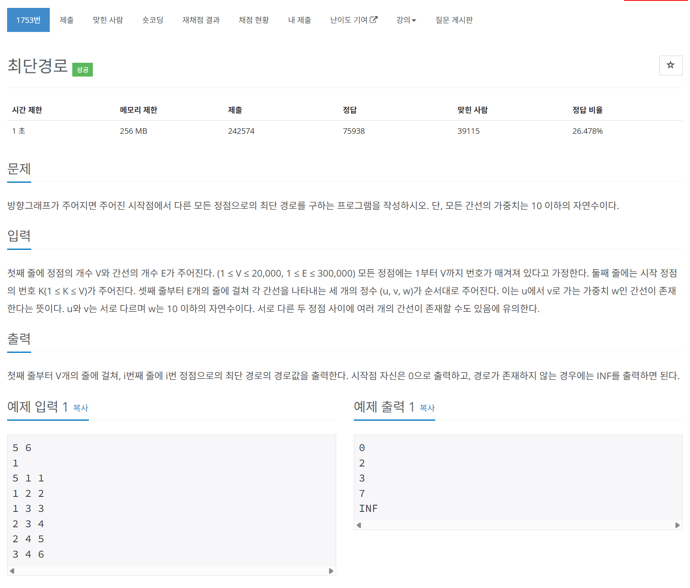

# 문제



# 코드
```
#include <iostream>
#include <queue>
#include <vector>
#include <string>

using namespace std;

class Compare{
  public:
  bool operator()(pair<int, int> a, pair<int, int> b)
  {
    return a.second > b.second;
  }
};

void Dijkstra(vector<vector<pair<int, int> > > &graph, vector<int> &distance, int start_node)
{
  priority_queue<pair<int, int>, vector<pair<int, int> >, Compare> queue;
  queue.push(make_pair(start_node, 0));
  while(!queue.empty())
  {
    int now_node = queue.top().first;
    int now_dist = queue.top().second;
    queue.pop();

    for (int i = 0; i < graph[now_node].size(); i++)
    {
      int next_node = graph[now_node][i].first;
      int next_dist = graph[now_node][i].second;
      if (distance[next_node] == -1 || now_dist + next_dist < distance[next_node])
      {
        distance[next_node] = now_dist + next_dist;
        queue.push(make_pair(next_node, now_dist + next_dist));
      }
    }
  }
}

int main() 
{
  ios::sync_with_stdio(false);
  cin.tie(nullptr);

  int V, E;
  cin >> V >> E;
  int K;
  cin >> K;
  vector<vector<pair<int, int> > > graph(V + 1);
  for (int i = 0; i < E; i++)
  {
    int graph_index, end_node, dist;
    cin >> graph_index >> end_node >> dist;
    graph[graph_index].push_back(make_pair(end_node, dist));
  }
  vector<int> distance(V + 1, -1);
  distance[K] = 0;

  Dijkstra(graph, distance, K);

  string output_buffer;
  for (int i = 1; i <= V; i++)
  {
    if (distance[i] == -1)
    {
      output_buffer += "INF";
    }
    else
    {
      output_buffer += to_string(distance[i]);
    }
    output_buffer += "\n";
  }
  cout << output_buffer;
  return 0;
}
```

# 풀이 과정
전형적인 다익스트라 문제이다.  
인접 리스트로 그래프를 저장하고  
거리 리스트에 거리들을 무한대로 초기화한다.  
우선 순위 큐를 통해 가중치의 합이 최소인 경우부터  
넓이 우선 탐색을 이용한다.  