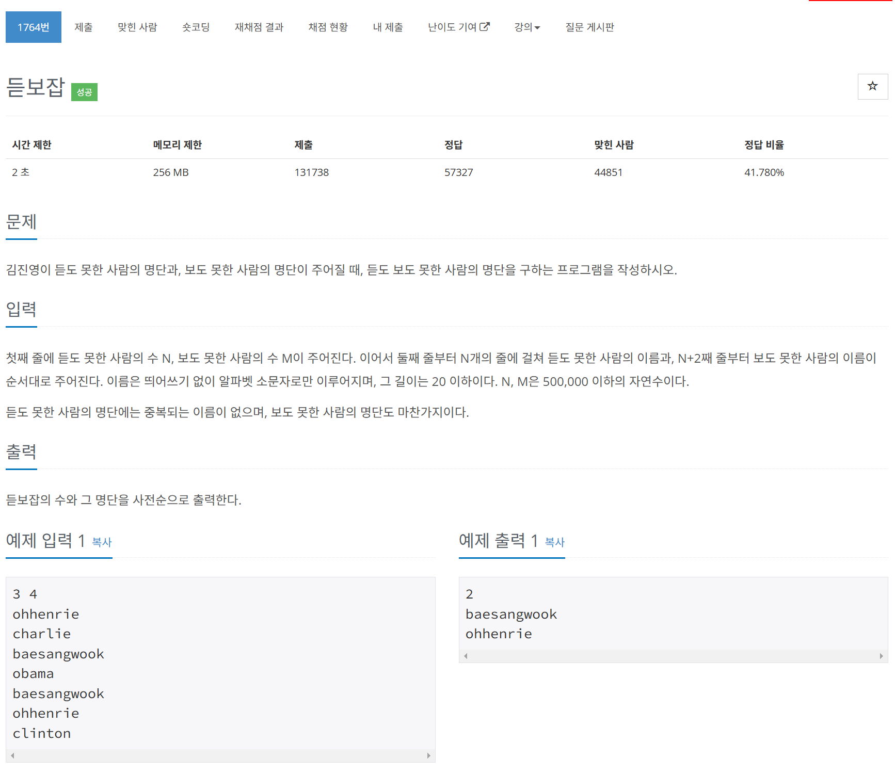

# 문제



# 코드
```
#include <iostream>
#include <vector>
#include <algorithm>
#include <string>
#include <ios>

int main() 
{
  std::ios_base::sync_with_stdio(false);
  std::cin.tie(nullptr);
  std::cout.tie(nullptr);

  int N, M;
  std::cin >> N >> M;
  
  std::vector<std::string> name1(N);
  for (int i = 0; i < N; i++) {
    std::cin >> name1[i];
  }
  sort(name1.begin(), name1.end());
  
  std::vector<std::string> name2(M);
  for (int i = 0; i < M; i++) {
    std::cin >> name2[i];
  }

  std::vector<std::string> result;
  for (int i = 0; i < M; i++) {
    if (binary_search(name1.begin(), name1.end(), name2[i])) {
      result.push_back(name2[i]);
    }
  }
  sort(result.begin(), result.end());
  
  int result_size = result.size();
  std::cout << result_size << '\n';
  for (int i = 0; i < result_size; i++) {
    std::cout << result[i] << '\n';
  }
  return 0;
}
```

# 풀이 과정
선형 탐색으로 찾으면 O(N * M)시간이 걸리므로  
정렬해준 뒤 binary search로 찾았다.  