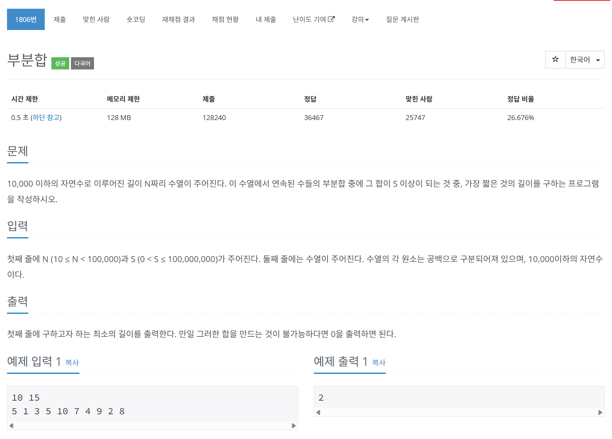

# 문제



# 코드
```
#include <iostream>
#include <vector>

using namespace std;
int main()
{
  ios::sync_with_stdio(false);
  cin.tie(nullptr);

  int N, S;
  cin >> N >> S;
  vector<int> numbers_vector(N, 0);
  for (int i = 0; i < N; i++)
  {
    cin >> numbers_vector[i];
  }
  int start = 0, end = 0;
  int sum = numbers_vector[0], dist = N + 1;
  while (start < N)
  {
    if (sum < S)
    {
      if (end == N - 1)
      {
        break;
      }
      end++;
      sum += numbers_vector[end];
    }
    else
    {
      if (dist > (end - start + 1))
      {
        dist = (end - start + 1);
      }
      sum -= numbers_vector[start];
      start++;
    }
  }
  if (dist > N)
  {
    cout << "0\n";
  }
  else
  {
    cout << dist << "\n";
  }
  
  return 0;
}
```

# 풀이 과정
부분합이라는 키워드에 너무 집중해서 너무 헤맸다.  
two pointer을 이용해 구간을 조절하면서 최소 구간을 갱신하는 문제이다.  