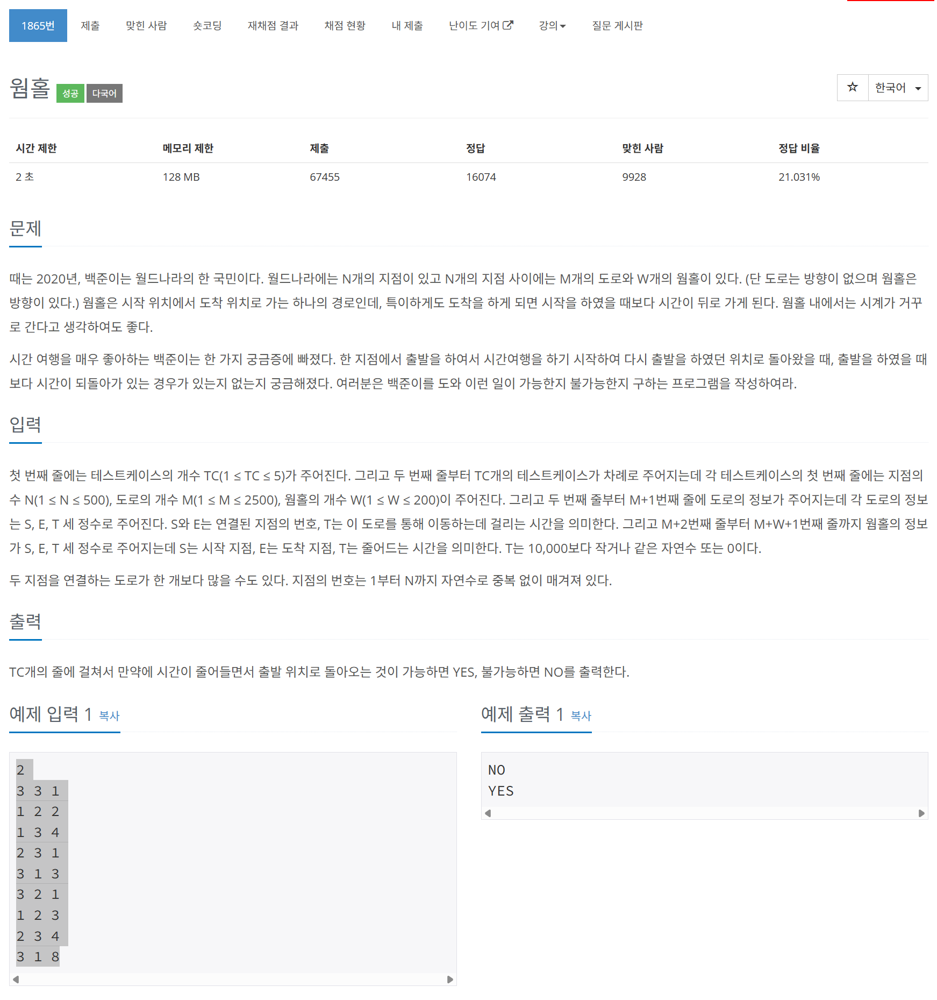

# 문제



# 코드
```
#include <iostream>
#include <vector>

using namespace std;

bool relax(vector<vector<pair<int, int> > > &graph, int nodes, vector<int> &distances)
{
  bool updated = false;
  for (int now_node = 0; now_node <= nodes; now_node++)
  {
    for (auto next : graph[now_node])
    {
      auto [next_node, next_distance] = next;
      if (distances[next_node] > distances[now_node] + next_distance)
      {
        updated = true;
        distances[next_node] = distances[now_node] + next_distance;
      }
    }
  }
  return updated;
}

int main()
{
  int TC;
  cin >> TC;
  for (int program_count = 0; program_count < TC; program_count++)
  {
    int N, M, W;
    cin >> N >> M >> W;
    vector<vector<pair<int, int> > > graph(N + 1);
    for (int i = 0; i < M; i++)
    {
      int S, E, T;
      cin >> S >> E >> T;
      graph[S].push_back(make_pair(E, T));
      graph[E].push_back(make_pair(S, T));
    }
    for (int i = 0; i < W; i++)
    {
      int S, E, T;
      cin >> S >> E >> T;
      graph[S].push_back(make_pair(E, T * -1));
    }
    vector<int> distances(N + 1);
    for (int i = 0; i < N + 1; i++)
    {
      distances[i] = 0;
    }
    for (int i = 0; i < N - 1 && relax(graph, N, distances); i++);
    if (relax(graph, N, distances))
    {
      cout << "YES\n";
    }
    else
    {
      cout << "NO\n";
    }
  }
  return 0;
}
```

# 풀이 과정
음수 가중치가 있는 간선 그래프에서  
최단 거리를 구하는 알고리즘은 벨만-포드 알고리즘이다.  
  
벨만-포드 알고리즘은 어느 한 시작점에서 모든 정점으로 가는 길의 최대 간선의 개수는  
(모든 정점의 개수 - 1) 이하라는 점을 이용한다.  
따라서 한 시작점에서 (모든 정점의 개수 - 1)만큼 반복하며 정점으로의 최단 거리를 업데이트 한다.  
  
이때 음수 가중치의 간선에 의해 음수 사이클(음의 무한대로 가는 사이클)이 발생 할 수 있는데,  
이는 한 번 더 업데이트가 되는지를 확인하여 음수 사이클의 존재 여부를 확인한다.  
(이때 최단거리 업데이트를 이 알고리즘에서는 안정화, relax라 한다.)  

그러나 음수 사이클을 검출해야하는 이 문제에서는 모든 그래프가 연결이 되어있지 않을 가능성이 있었다.  
그래서 Super Source(슈퍼 소스) 기법을 활용하여 문제를 풀이하였다.  
Super Source 기법이란 새로운 정점을 추가하여 이 간선에서 모든 정점으로의 가중치를 0으로 초기화 한 후  
이를 시작점으로 벨만 포드 알고리즘을 돌리는 기법이다.  
이렇게 하면 최단 거리는 더 이상 구할 수 없지만 업데이트가 되는지 안되는지를 통해 음수 사이클을 검출해낼 수 있다.  