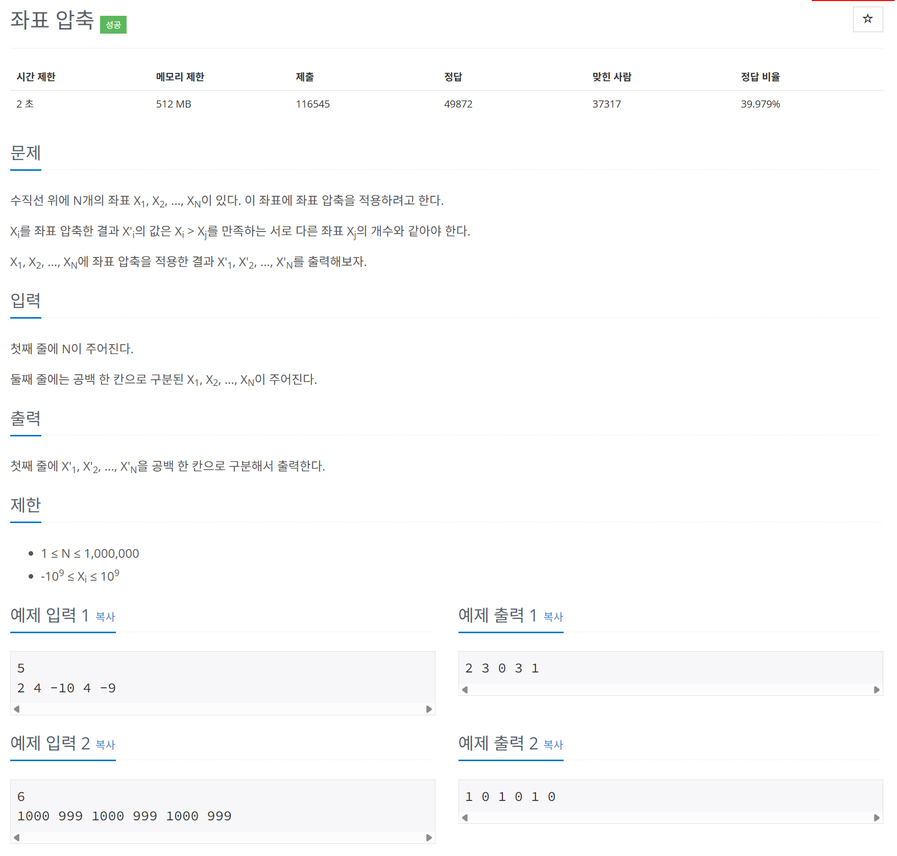

# 문제



# 코드
```
#include <iostream>
#include <vector>
#include <algorithm>
#include <unordered_map>

int main() 
{
  int N;
  std::cin >> N;
  std::vector<int> v(N);
  
  for (int i = 0; i < N; i++)
  {
    std::cin >> v[i];
  }
  std::vector<int> sorted_v = v;

  std::sort(sorted_v.begin(), sorted_v.end());
  sorted_v.erase(std::unique(sorted_v.begin(), sorted_v.end()), sorted_v.end());

  std::unordered_map<int, int> compressed_map;
  for (int i = 0; i < sorted_v.size(); i++)
  {
    compressed_map[sorted_v[i]] = i;
  }


  for (int i = 0; i < N; i++)
  {
    std::cout << compressed_map[v[i]] << " ";
  }
  return 0;
}
```

# 풀이 과정
해쉬 맵, unordered map에 대해 공부하는 문제였다.  
key, value로 값을 저장하는데  
저장하는 위치가 key값을 hash 함수를 돌려 나온 값을 인덱스로 하여 저장한다.  
따라서 key, value를 검색하는데 O(1)의 시간만 소요하므로  
엄청 빠른 자료구조라 할 수 있다.  