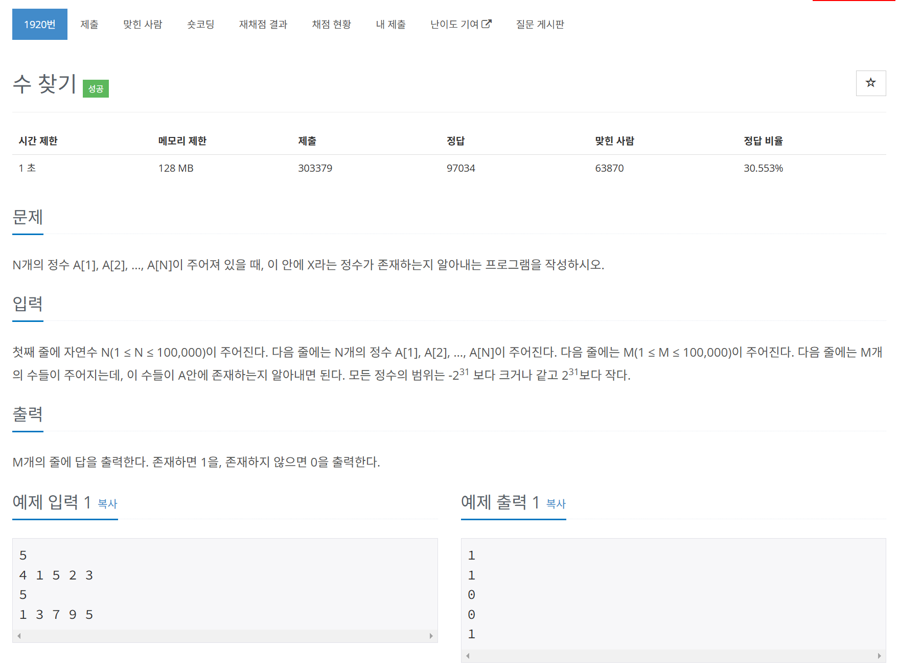

# 문제



# 코드
```
#include <iostream>
#include <vector>
#include <algorithm>

int main() 
{
  std::vector<int> a;
  std::vector<int> v;
  int n, m;
  std::cin >> n;
  for (int i = 0; i < n; i++) {
    int temp;
    std::cin >> temp;
    a.push_back(temp);
  }
  std::sort(a.begin(), a.end());
  std::cin >> m;
  for (int i = 0; i < m; i++) {
    int temp;
    std::cin >> temp;
    v.push_back(temp);
  }
  for (int i = 0; i < m; i++) {
    int left = 0;
    int right = n - 1;
    int mid;
    while (left <= right) {
      mid = (left + right) / 2;
      if (a[mid] == v[i]) {
        std::cout << 1 << '\n';
        break;
      }
      else if (a[mid] < v[i]) {
        left = mid + 1;
      }
      else {
        right = mid - 1;
      }
    }
    if (left > right) {
      std::cout << 0 << '\n';
    }
  }
  return 0;
}
```

# 풀이 과정
선형 탐색으로 풀었더니 시간 초과가 나서  
정렬한 뒤 이분 탐색으로 풀었다.  
  
# 더 좋은 코드
```
#include <iostream>
#include <vector>
#include <algorithm>

int main()
{
    int N, M;
    std::cin >> N;
    std::vector<int> A(N);
    for (int i = 0; i < N; i++)
    {
        std::cin >> A[i];
    }
    std::sort(A.begin(), A.end());
    std::cin >> M;
    std::vector<int> B(M);
    for (int i = 0; i < M; i++)
    {
      std::cin >> B[i];
    }
    for (int i = 0; i < M; i++)
    {
      if (std::binary_search(A.begin(), A.end(), B[i]))
      {
        std::cout << "1\n";
      }
      else
      {
        std::cout << "0\n";
      }
    }
    return 0;
}
```
algorithm 헤더에 binary_search 메소드가 있었다.  