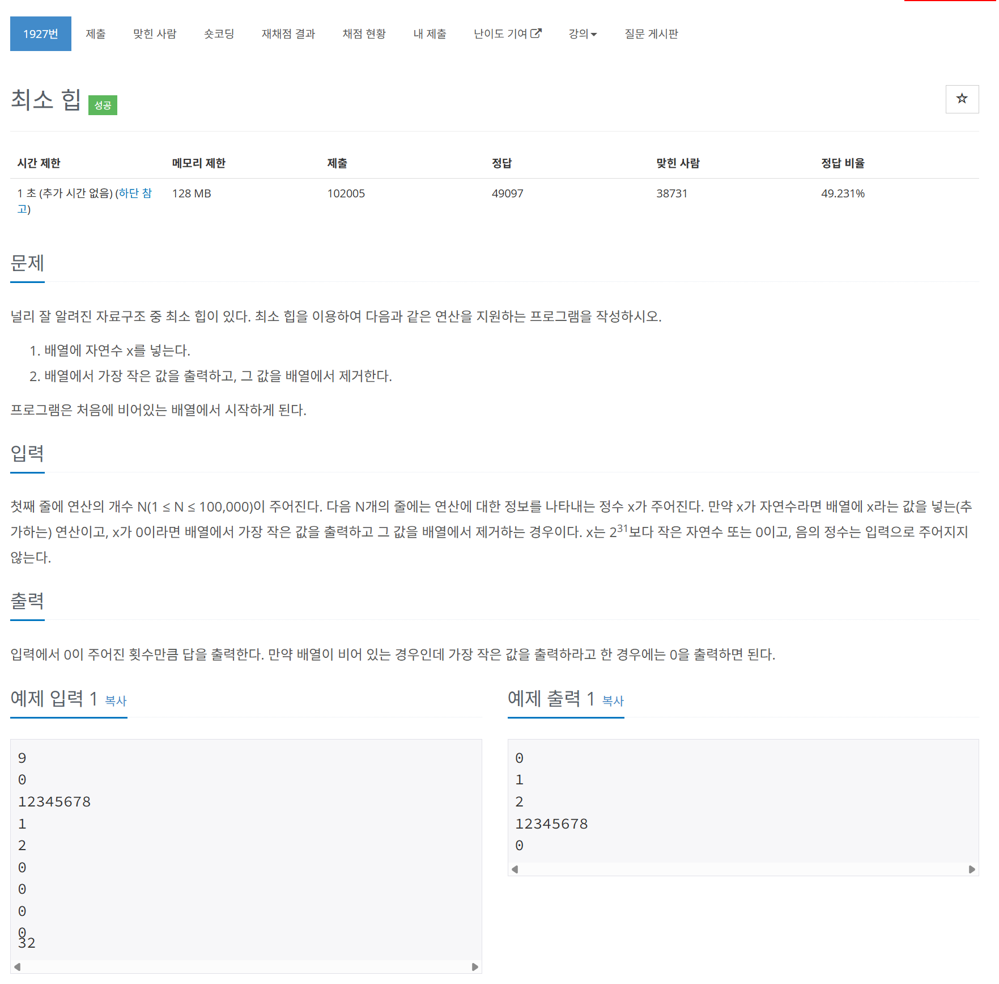

# 문제



# 코드
```
#include <iostream>
#include <queue>
#include <functional>
#include <cstdio>  // For using scanf and printf

int main() 
{
  std::ios_base::sync_with_stdio(false);
  std::cin.tie(NULL);

  std::priority_queue<int, std::vector<int>, std::greater<int>> q;
  unsigned int n;
  std::scanf("%u", &n);  // Using scanf for faster input
  for (unsigned int i = 0; i < n; i++)
  {
    int command;
    std::scanf("%d", &command);  // Using scanf for faster input
    if (command == 0)
    {
      if (q.empty())
      {
        std::printf("0\n");  // Using printf and \n for faster output
      }
      else
      {
        std::printf("%d\n", q.top());  // Using printf for faster output
        q.pop();
      }
    }
    else
    {
      q.push(command);
    }
  }
  return 0;
}
```

# 풀이 과정
우선 순위 큐와 최소 힙에 대해 공부하였다.  
그리고 속도 향상을 위해 scanf와 printf를 사용하였다.  
cin과 cout으로는 시간 초과가 나던 문제다.  