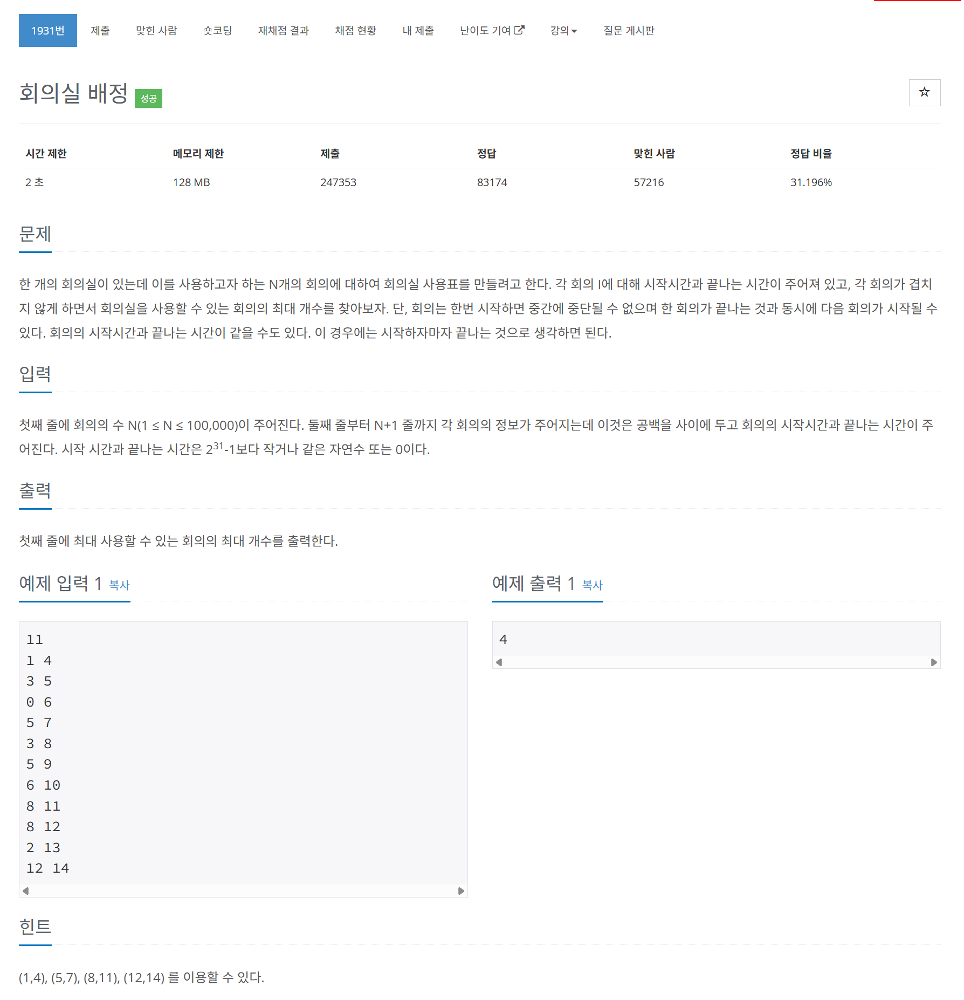

# 문제



# 코드
```
#include <iostream>
#include <vector>
#include <algorithm>

bool compare(std::pair<int, int> a, std::pair<int, int> b)
{
  if (a.second == b.second)
    return a.first < b.first;
  return a.second < b.second;
}

int main() 
{
  int N;
  std::cin >> N;
  std::vector<std::pair<int, int>> meeting_times_vector;
  for (int i = 0; i < N; i++)
  {
    int start, end;
    std::cin >> start >> end;
    meeting_times_vector.push_back({start, end});
  }
  std::sort(meeting_times_vector.begin(), meeting_times_vector.end(), compare);

  int meeting_cnt = 0;
  std::pair<int, int> meeting_now = {-1, -1};
  for (int i = 0; i < N; i++)
  {
    if (meeting_times_vector[i].first >= meeting_now.second)
    {
      meeting_cnt++;
      meeting_now = meeting_times_vector[i];
    }
  }

  std::cout << meeting_cnt << std::endl;
  return 0;
}
```

# 풀이 과정
뒷 부분만 오름차순으로 정렬해주면 될 줄 알았더니  
(더 빠르게 찾기 위함이었음)  
앞부분도 뒷부분이 오름차순 정렬되어있는 상태에서 풀어야지만  
이전 회의가 끝나는 시간과 동일한 시작 시간의 회의까지도 판단 할 수 있다.  