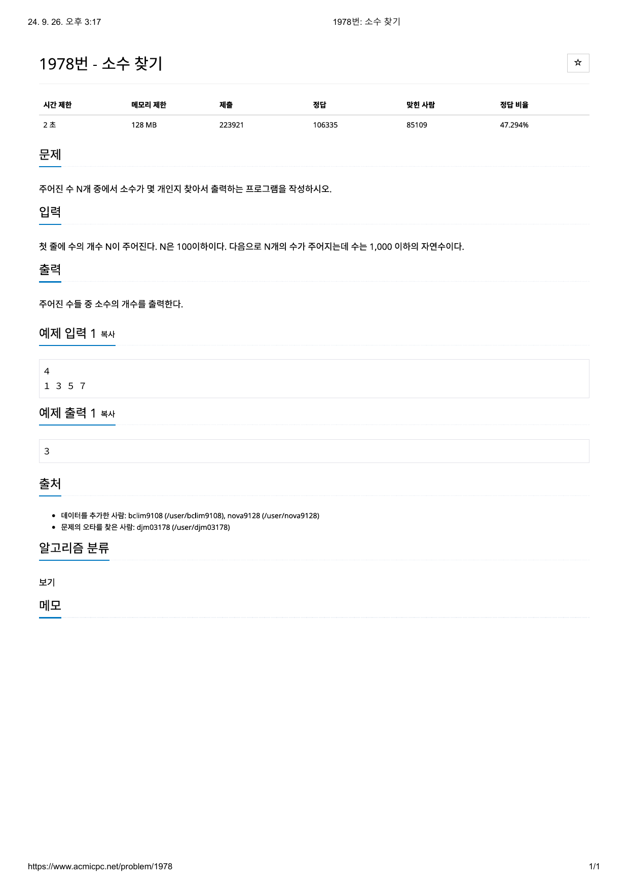

# 문제



# 코드
```
#include <iostream>

int isPrime(int n)
{
  int i;
  if (n <= 1)
    return 0;
  for (i = 2; i * i <= n; i++)
  {
    if (n % i == 0)
      return 0;
  }
  return 1;
}

int main() 
{
  int rotate;
  int num;
  int num_prime = 0;

  std::cin >> rotate;
  for(int i = 0; i < rotate; i++)
  {
    std::cin >> num;
    if (isPrime(num))
      num_prime++;
  }
  std::cout << num_prime << std::endl;
  return 0;
}
```

# 풀이 과정
n이 소수인지 판단하기 위해서 루트n까지만 확인해보면 된다고 한다.