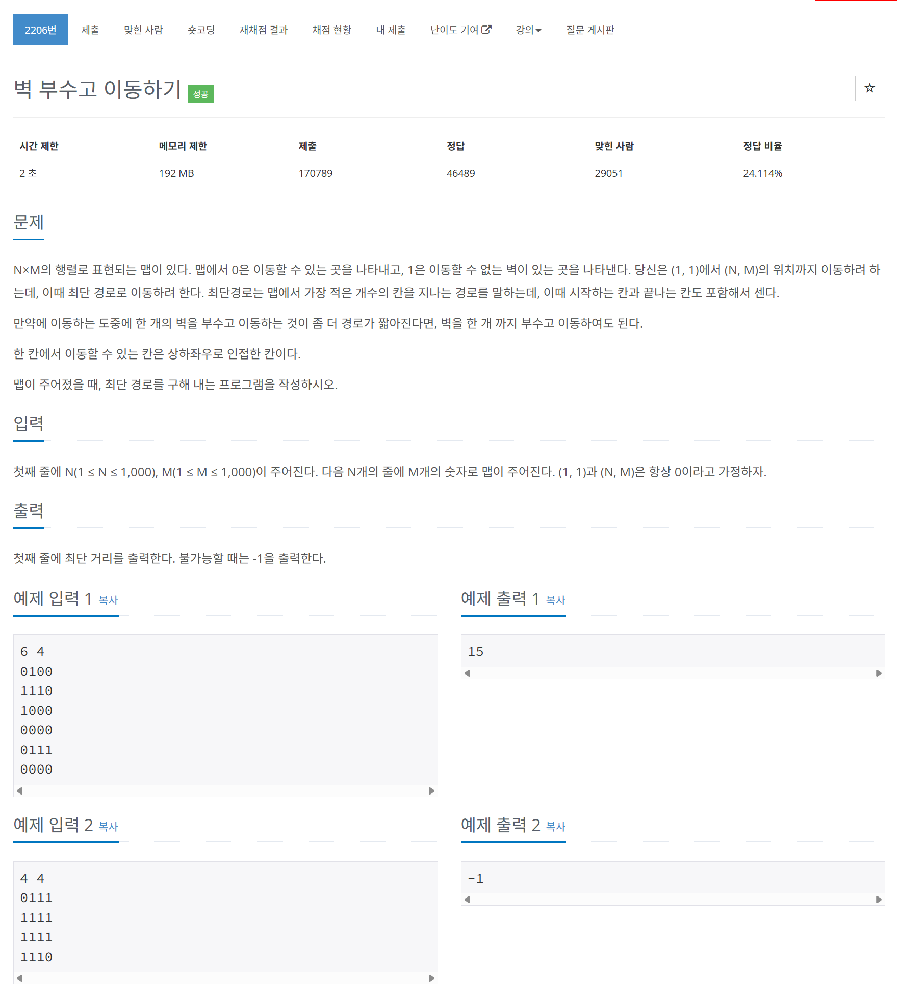

# 문제



# 코드
```
#include <iostream>
#include <queue>
#include <vector>
#include <string>

using namespace std;

int main() 
{
  int N, M;
  cin >> N >> M;
  vector<string> map(N);
  for (int i = 0; i < N; i++)
  {
    cin >> map[i]; 
  }

  //pair<pair<pos_y, pos_x>, pair<move_count, break_wall_count> >
  queue<pair<pair<int, int>, pair<int, int>> > to_go_pos;
  to_go_pos.push(make_pair(make_pair(0, 0), make_pair(1, 0)));
  vector<int> y_move = {0, 0, 1, -1};
  vector<int> x_move = {1, -1, 0, 0};
  vector<vector<vector<bool> > > visited(N, vector(M, (vector(2, false))));
  visited[0][0][0] = true;
  while (!to_go_pos.empty())
  {
    auto now = to_go_pos.front();
    auto [now_pos_y, now_pos_x] = now.first;
    auto [now_move_count, break_wall_count] = now.second;
    to_go_pos.pop();
    if (now_pos_y == N - 1 && now_pos_x == M - 1)
    {
      cout << now_move_count << "\n";
      return 0;
    }
    for (int i = 0; i < 4; i++)
    {
      if (now_pos_y + y_move[i] > -1 && now_pos_y + y_move[i] < N && now_pos_x + x_move[i] > - 1 && now_pos_x + x_move[i] < M && visited[now_pos_y + y_move[i]][now_pos_x + x_move[i]][break_wall_count] == false)
      {
        if (map[now_pos_y + y_move[i]][now_pos_x + x_move[i]] == '1')
        {
          if (break_wall_count == 0)
          {
            visited[now_pos_y + y_move[i]][now_pos_x + x_move[i]][1] = true;
            to_go_pos.push(make_pair(make_pair(now_pos_y + y_move[i], now_pos_x + x_move[i]), make_pair(now_move_count + 1, break_wall_count + 1)));
          }
        }
        else
        {
          visited[now_pos_y + y_move[i]][now_pos_x + x_move[i]][break_wall_count] = true;
          to_go_pos.push(make_pair(make_pair(now_pos_y + y_move[i], now_pos_x + x_move[i]), make_pair(now_move_count + 1, break_wall_count)));
        }
      }
    }
  }
  cout << "-1\n";
  return 0;
}
```

# 풀이 과정
visited 배열을 벽을 부쉈는지 안부쉈는지에 따라 한 차원을 더 높여 저장해 풀었다.