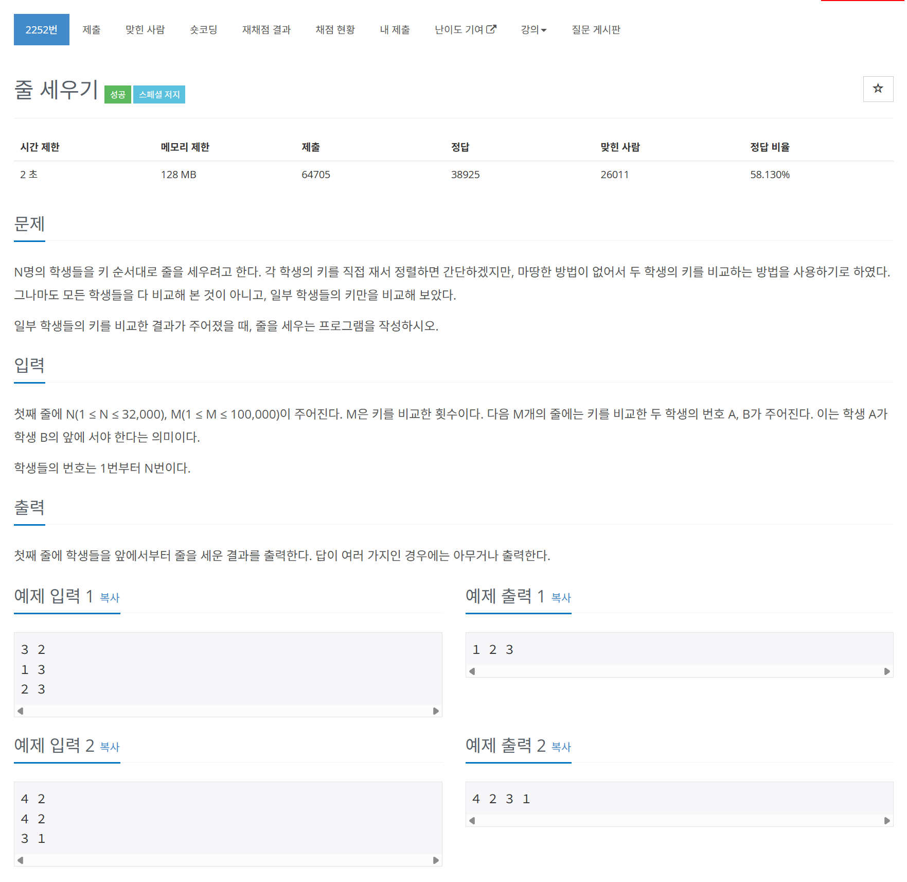

# 문제



# 코드
```
#include <iostream>
#include <queue>
#include <vector>

using namespace std;

int indegree[32001];

int main()
{
  int N, M;
  cin >> N >> M;
  vector<vector<int> > graph_v(N + 1, vector<int>());
  for (int i = 0; i < M; i++)
  {
    int start, end;
    cin >> start >> end;
    graph_v[start].push_back(end);
    indegree[end]++;
  }
  queue<int> topology_q;
  for (int i = 1; i <= N; i++)
  {
    if (indegree[i] == 0)
    {
      topology_q.push(i);
    }
  }
  while (!topology_q.empty())
  {
    int now = topology_q.front();
    topology_q.pop();
    cout << now << " ";
    for (int next : graph_v[now])
    {
      indegree[next]--;
      if (indegree[next] == 0)
      {
        topology_q.push(next);
      }
    }
  }
  cout << "\n";
  return 0;
}
```

# 풀이 과정
Topological Sort(위상 정렬)의 전형적인 문제다.  
차수(indegree)를 뒤에 위치할 때 마다 한 개씩 높인다.  
이후 차수가 0인 곳 부터 큐에 넣고 next일 때 마다 차수를 하나 내린다.  
차수가 0이면 다시 큐에 넣는다.  