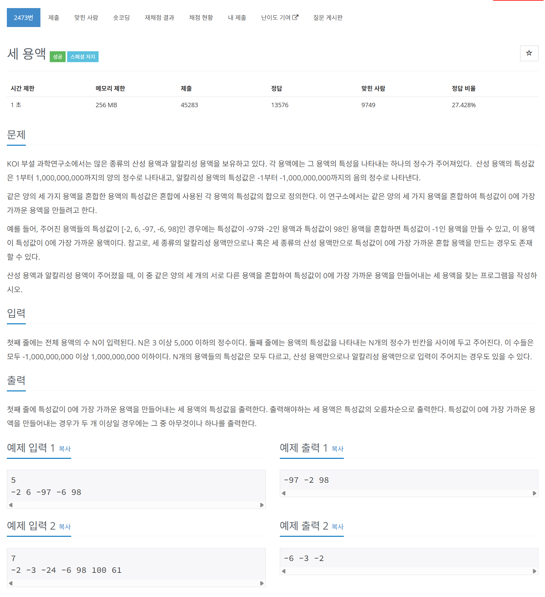

# 문제



# 코드
```
#include <iostream>
#include <vector>
#include <cmath>
#include <algorithm>

using namespace std;

int main()
{
  int N;
  cin >> N;
  vector<long long> liquid_v(N, 0);
  for (int i = 0; i < N; i++)
  {
    cin >> liquid_v[i];
  }
  sort(liquid_v.begin(), liquid_v.end());
  int offset = 0, right = N - 1, left = 1;
  vector<long long> to_mix_v(4, 0);
  to_mix_v[0] = liquid_v[offset];
  to_mix_v[1] = liquid_v[left];
  to_mix_v[2] = liquid_v[right];
  to_mix_v[3] = to_mix_v[0] + to_mix_v[1] + to_mix_v[2];
  for (; offset < N - 2; offset++)
  {
    for (left = offset + 1, right = N - 1; left < right;)
    {
      long long new_mixed = liquid_v[offset] + liquid_v[left] + liquid_v[right];
      if (abs(to_mix_v[3]) > abs(new_mixed))
      {
        to_mix_v[0] = liquid_v[offset];
        to_mix_v[1] = liquid_v[left];
        to_mix_v[2] = liquid_v[right];
        to_mix_v[3] = to_mix_v[0] + to_mix_v[1] + to_mix_v[2];
      }
      if (new_mixed < 0)
      {
        left++;
      }
      else
      {
        right--;
      }
    }
  }
  cout << to_mix_v[0] << " " << to_mix_v[1] << " " << to_mix_v[2] << "\n";
  return 0;
}
```

# 풀이 과정
하나를 고정하고 투 포인터로 푸는 문제이다.  
1개의 포인터를 가장 왼쪽에서 한 칸씩 옮기며,  
그때를 기준으로 고정한 지점의 왼쪽과 오른쪽의 양 끝에서 투 포인터로 푼다.  
이때, 투 포인터의 움직이는 기준은 세 물질의 총 합이다.  