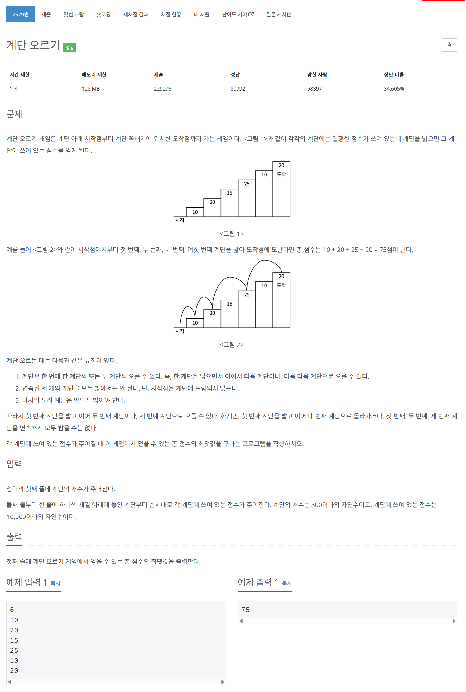

# 문제



# 코드
```
#include <iostream>
#include <vector>

#define LIMIT 300

using namespace std;

int cache[2][LIMIT] = {0, };

int DpStair(int stair, int series, vector<int> stair_point_vector)
{
  if (stair < 1 || cache[series][stair])
  {
    return (cache[series][stair]);
  }
  switch (series)
  {
  case 0:
    cache[series][stair] = max(DpStair(stair - 2, 0, stair_point_vector), DpStair(stair - 2, 1, stair_point_vector));
    break;
  default:
    cache[series][stair] = DpStair(stair - 1, series - 1, stair_point_vector);
    break;
  }
  cache[series][stair] += stair_point_vector[stair];
  return (cache[series][stair]);
}

int main() 
{
  int stair_num;
  cin >> stair_num;
  vector<int> stair_point_vector(stair_num, 0);
  for (int i = 0; i < stair_num; i++)
  {
    cin >> stair_point_vector[i];
  }
  cache[0][0] = stair_point_vector[0];
  cout << max(DpStair(stair_num - 1, 0, stair_point_vector), DpStair(stair_num - 1, 1, stair_point_vector)) << endl;
  return 0;
}
```

# 풀이 과정
핵심 아이디어는 냅색 알고리즘과 같다.  
계단을 뒤에서부터 봤을 때 연속인가 아닌가를 통해 분기되고  
그 계단을 밟느냐 아니냐에 따라 분기된다.  
따라서 2차원 점화식이 필요하다.  
  
이를 이용해 DP로 풀었다.  