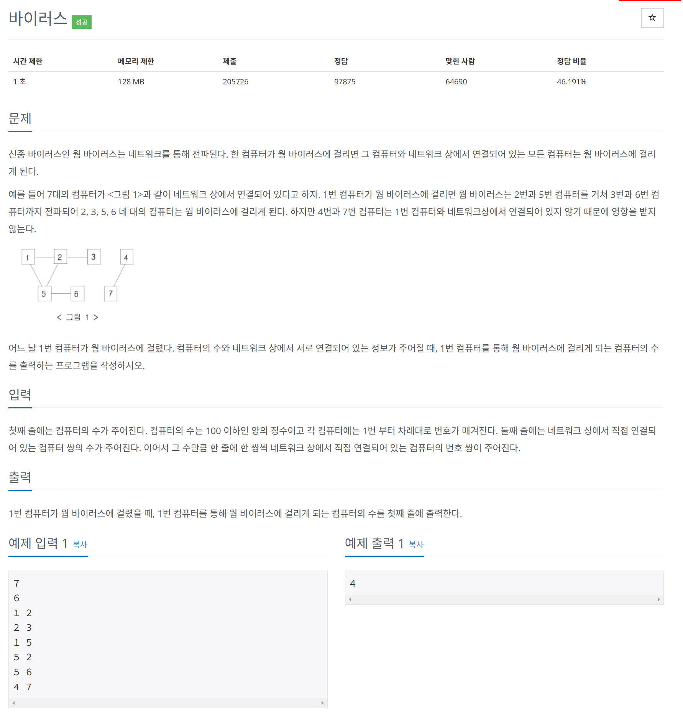

# 문제



# 코드
```
#include <iostream>

int computers[101][101] = {0, };
int visited[101] = {0, };

void dfs_visiting(int limit, int current)
{
  visited[current] = 1;
  for (int i = 1; i <= limit; i++)
  {
    if (computers[current][i] == 1 && visited[i] == 0)
    {
      dfs_visiting(limit, i);
    }
  }
}

int main()
{
  int n, m;
  std::cin >> n >> m;
  for (int i = 0; i < m; i++)
  {
    int a, b;
    std::cin >> a >> b;
    computers[a][b] = 1;
    computers[b][a] = 1;
  }
  dfs_visiting(n, 1);
  int answer = 0;
  for (int i = 2; i <= n; i++)
  {
    if (visited[i] == 1)
    {
      answer++;
    }
  }
  std::cout << answer << std::endl;
  return 0;
}
```

# 풀이 과정
깊이 우선 탐색을 해야하는데,  
넓이 우선 탐색으로 끝까지 확인하지도 않고  
2수준까지만 확인하여 많이 틀렸다.  