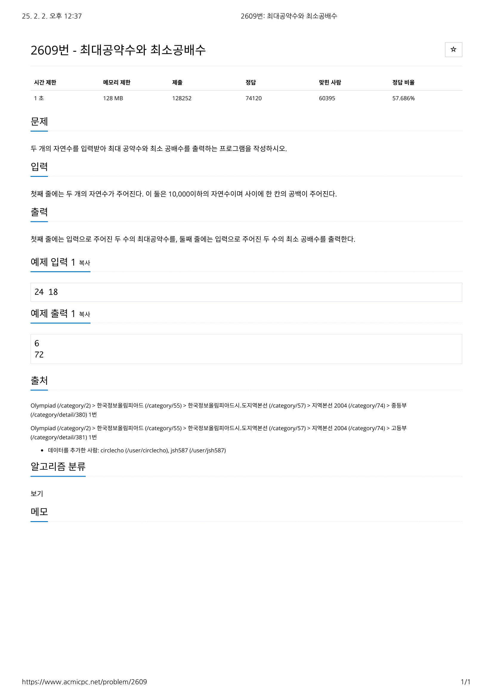

# 문제



# 코드
```
#include <iostream>

bool is_factor(int factor, int target_num)
{
  return (target_num % factor == 0);
}

int main() 
{
  int *factors_num1 = new int[10000];
  factors_num1[0] = 1;
  int *factors_num2 = new int[10000];
  factors_num2[0] = 1;
  int temp_num;
  int num1, num2;
  int greatest_common_divisor = 1, least_common_multiple = 1;

  std::cin >> num1 >> num2;

  temp_num = num1;
  for (int cnt = 1; cnt < temp_num; cnt++)
  {
    while (is_factor(cnt + 1, temp_num))
    {
      factors_num1[cnt]++;
      temp_num /= (cnt + 1);
    }
  }
  temp_num = num2;
  for (int cnt = 1; cnt < temp_num; cnt++)
  {
    while (is_factor(cnt + 1, temp_num))
    {
      factors_num2[cnt]++;
      temp_num /= (cnt + 1);
    }
  }

  for (int cnt = 0; cnt < num1 && cnt < num2; cnt++)
  {
    if (factors_num1[cnt] != 0 && factors_num2[cnt] != 0)
    {
      for (int cnt2 = 0; cnt2 < ((factors_num1[cnt] > factors_num2[cnt]) ? factors_num2[cnt] : factors_num1[cnt]); cnt2++)
      greatest_common_divisor *= (cnt + 1);
    }
  }

  for (int cnt = 0; cnt < 10000; cnt++)
  {
    if (factors_num1[cnt] != 0 or factors_num2[cnt] != 0)
    {
      for (int cnt2 = 0; cnt2 < ((factors_num1[cnt] > factors_num2[cnt]) ? factors_num1[cnt] : factors_num2[cnt]); cnt2++)
      least_common_multiple *= (cnt + 1);
    }
  }

  std::cout << greatest_common_divisor << std::endl;
  std::cout << least_common_multiple << std::endl;

  delete[] factors_num1;
  delete[] factors_num2;
  return 0;
}
```

# 풀이 과정
```
  for (int cnt = 1; cnt < temp_num; cnt++)
  {
    while (is_factor(cnt + 1, temp_num))
    {
      factors_num1[cnt]++;
      temp_num /= (cnt + 1);
    }
  }
```
이 부분의 while부분을 if로 써서 약수를 모두 나누어주어야 했는데 한 번씩만 체크하고 넘어갔기에 틀리게 되었다.
또 나와 같은 코드를 짜면 최대공약수를 구하는 함수와 최소공배수를 구하는 함수를 만들지 않았기에 나중에 활용하기 어렵다.

# 더 좋은 코드
https://sectumsempra.tistory.com/77
위 페이지에서는 유클리드 호제법을 통해 최대공약수를 빠르게 구하고
'최대공약수 * 최소공배수 = 두 수의 곱' 임을 이용하여 '두 수의 곱 / 최대공약수'를 통해 최소공배수를 구해낸다.
훨씬 간편하고 훨씬 코드가 짧아보인다.