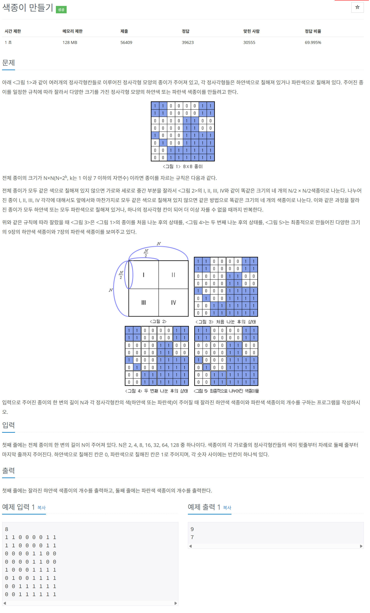

# 문제



# 코드
```
#include <iostream>

int FindWhichPaper(int **paper, int limit, int x_pos, int y_pos, int *white_count, int *blue_count)
{
  if (limit == 1)
  {
    if (paper[y_pos][x_pos] == 1)
    {
      return 1;
    }
    else
    {
      return 0;
    }
  }
  limit /= 2;
  int first = FindWhichPaper(paper, limit, x_pos, y_pos, white_count, blue_count);
  int second = FindWhichPaper(paper, limit, x_pos + limit, y_pos, white_count, blue_count);
  int third = FindWhichPaper(paper, limit, x_pos, y_pos + limit, white_count, blue_count);
  int fourth = FindWhichPaper(paper, limit, x_pos + limit, y_pos + limit, white_count, blue_count);
  if (first == 1 && second == 1 && third == 1 && fourth == 1)
    return 1;
  else if (first == 0 && second == 0 && third == 0 && fourth == 0)
    return 0;
  switch (first)
  {
  case 0:
    (*white_count)++;
    break;
  case 1:
    (*blue_count)++;
    break;
  }
  switch (second)
  {
  case 0:
    (*white_count)++;
    break;
  case 1:
    (*blue_count)++;
    break;
  }
  switch (third)
  {
  case 0:
    (*white_count)++;
    break;
  case 1:
    (*blue_count)++;
    break;
  }
  switch (fourth)
  {
  case 0:
    (*white_count)++;
    break;
  case 1:
    (*blue_count)++;
    break;
  }
  return -1;
}

int main() 
{
  int N;
  std::cin >> N;
  int **paper = new int*[N];
  for (int i = 0; i < N; i++)
  {
    paper[i] = new int[N];
    for (int j = 0; j < N; j++)
    {
      std::cin >> paper[i][j];
    }
  }

  int white_number = 0;
  int blue_number = 0;

  int fin = FindWhichPaper(paper, N, 0, 0, &white_number, &blue_number);
  if (fin == 1)
  {
    blue_number++;
  }
  else if (fin == 0)
  {
    white_number++;
  }
  std::cout << white_number << std::endl;
  std::cout << blue_number << std::endl;
  
  for (int i = 0; i < N; i++)
  {
    delete[] paper[i];
  }
  delete[] paper;
  return 0;
}
```

# 풀이 과정
먼저 같은 색종이인지 검사를 하고 들어가면  
비교하는게 선형이라 너무 시간이 오래 걸릴 것 같아서  
먼저 분할해서 들어간 뒤 합칠 때 검사하도록 해주었다.  
근데 gpt는 먼저 검사하는 방식도 괜찮다고 한다.  