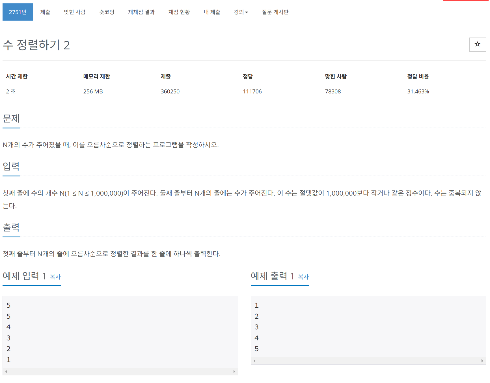

# 문제



# 코드
```
#include <iostream>
#include <vector>
#include <algorithm>

int main() 
{
  int n;
  std::cin >> n;
  std::vector<int> v(n);
  for (int i = 0; i < n; i++) {
    std::cin >> v[i];
  }
  std::sort(v.begin(), v.end());
  for (int i = 0; i < n; i++) {
    std::cout << v[i] << '\n';
  }
  return 0;
}
```

# 풀이 과정
이전 1181번 문제 풀이와 똑같이 풀었다.  
vector sort 함수나 c++11의 람다식이 기억나지 않는다면  
https://github.com/rocky55737/AlgoAfoc/blob/main/BaekJoon/1181/1181.md  
참조  