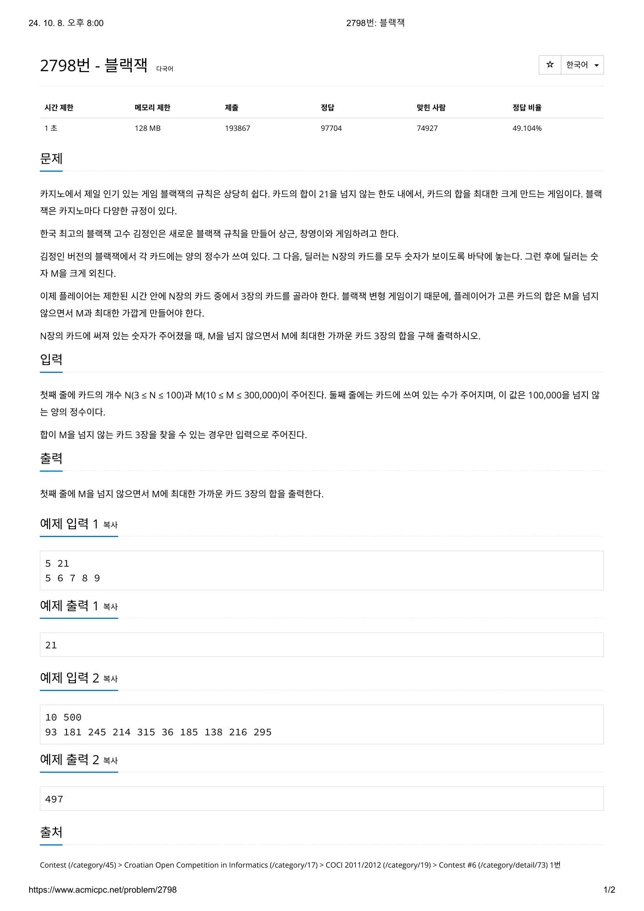
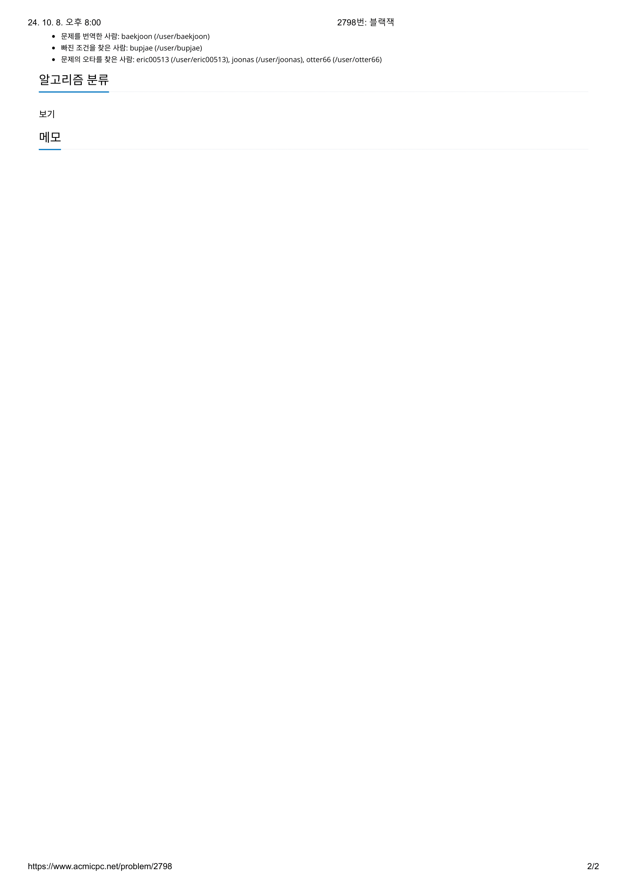

# 문제




# 코드
```
#include <iostream>
#include <vector>

int main() {
  std::vector<int> cards;
  int card, cards_num, sum_limit;
  int max_sum, tmp_sum;

  max_sum = 0;
  std::cin >> cards_num >> sum_limit;
  for (int i = 0; i < cards_num; i++) {
    std::cin >> card;
    cards.push_back(card);
  }
  for (int i = 0; i < cards_num - 2; i++) {
    for (int j = i + 1; j < cards_num - 1; j++) {
      for (int k = j + 1; k < cards_num; k++) {
        tmp_sum = cards[i] + cards[j] + cards[k];
        if (max_sum < tmp_sum && tmp_sum <= sum_limit)
          max_sum = tmp_sum;
      }
    }
  }
  std::cout << max_sum << std::endl;
  return 0;
}
```

# 풀이 과정
최대 100장의 카드에서 3장을 뽑으므로 경우의 수가 아무리 많아봐야 100 * 99 * 98 / 6 이므로 
100만을 넘지 않아 충분히 시간안에 가능하다고 생각하였다. 