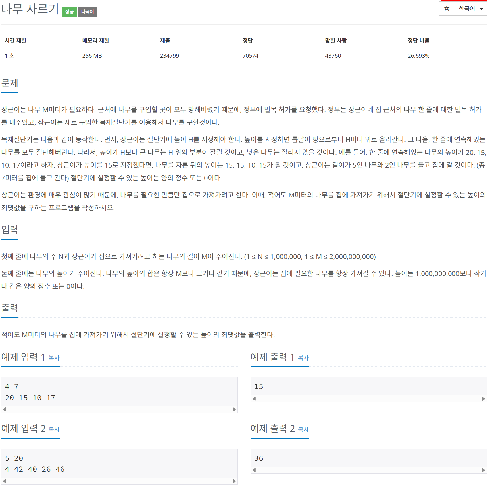

# 문제



# 코드
```
#include <iostream>
#include <vector>
#include <algorithm>

int main() 
{
  int N, M;
  std::cin >> N >> M;
  std::vector<int> trees(N);
  for (int i = 0; i < N; i++)
  {
    std::cin >> trees[i];
  }

  int end = *std::max_element(trees.begin(), trees.end());
  int start = 0;
  int result = 0;
  while(end >= start)
  {
    long long mid = (start + end) / 2;
    long long wood_sum = 0;
    for(int tree : trees)
    {
      if (tree > mid)
      {
        wood_sum += (tree - mid);
      }
    }
    if (wood_sum >= M)
    {
      result = mid;
      start = mid + 1;
    }
    else
    {
      end = mid - 1;
    }
  }
  std::cout << result << std::endl;
  return 0;
}
```

# 풀이 과정
이진 탐색으로 풀었다.  
이진 탐색 시 주의 할 사항들이 있다.  
범위를 start가 end보다 작거나 같을 때까지 탐색해야한다.  
start와 end가 같을 때에도 탐색해주어야 마지막까지 확인하게 된다.  