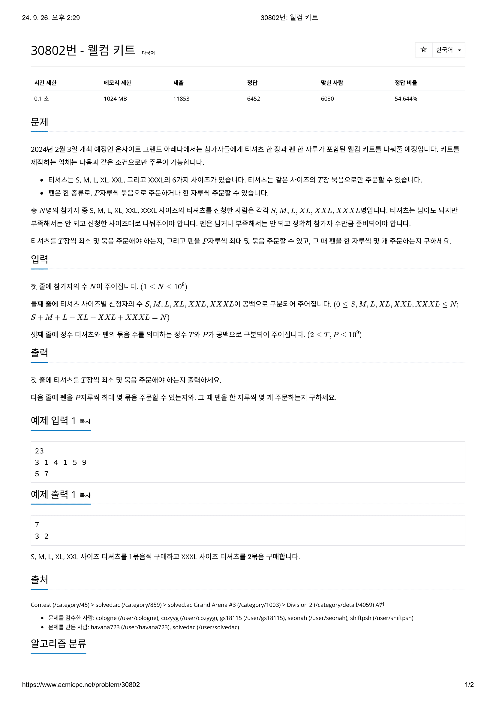
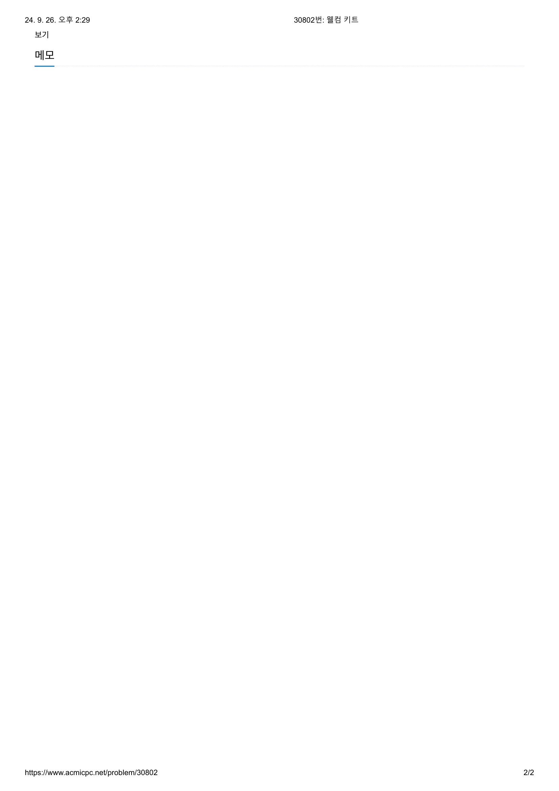

# 문제




# 코드
```
#include <iostream>

int main() 
{
  int total_people;
  int size_a, size_b, size_c, size_d, size_e, size_f;
  int shirts_bundle, pen_bundle;
  int num_shirts_bundle, num_pen_bundle, num_pen;

  std::cin >> total_people;
  std::cin >> size_a >> size_b >> size_c >> size_d >> size_e >> size_f;
  std::cin >> shirts_bundle >> pen_bundle;

  num_shirts_bundle = size_a / shirts_bundle;
  if (size_a % shirts_bundle != 0)
    num_shirts_bundle++;
  num_shirts_bundle += size_b / shirts_bundle;
  if (size_b % shirts_bundle != 0)
    num_shirts_bundle++;
  num_shirts_bundle += size_c / shirts_bundle;
  if (size_c % shirts_bundle != 0)
    num_shirts_bundle++;
  num_shirts_bundle += size_d / shirts_bundle;
  if (size_d % shirts_bundle != 0)
    num_shirts_bundle++;
  num_shirts_bundle += size_e / shirts_bundle;
  if (size_e % shirts_bundle != 0)
    num_shirts_bundle++;
  num_shirts_bundle += size_f / shirts_bundle;
  if (size_f % shirts_bundle != 0)
    num_shirts_bundle++;
  num_pen_bundle = total_people / pen_bundle;
  num_pen = total_people % pen_bundle;
  std::cout << num_shirts_bundle << "\n" << num_pen_bundle << " " << num_pen << std::endl;
  return 0;
}

```

# 틀린 이유
한 자루씩 몇 자루 주문해야하는지 출력해야하는 것을 깜빡했다.  
꼼꼼히 확인해야 한다.