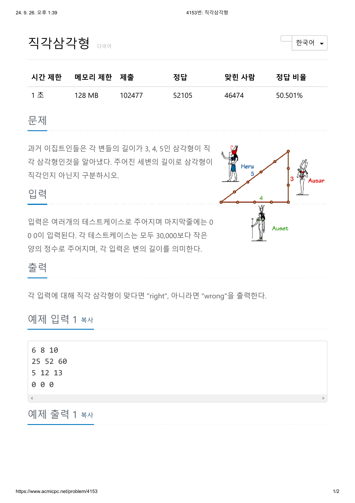

# 문제



```
#include <iostream>

int main()
{
  int a, b, c;
  
  std::cin >> a >> b >> c;
  while (a != 0 && b != 0 && c != 0)
  {
    if ((a * a + b * b == c * c) || (a * a + c * c == b * b) || (b * b + c * c == a * a))
      std::cout << "right" << std::endl;
    else
      std::cout << "wrong" << std::endl;
    std::cin >> a >> b >> c;
  }
  return 0;
}
```

풀이 과정
각각 들어올 정수의 값이 30000보다 작으므로
피타고라스의 정리를 이용해도 int의 범위를 넘지 않는다고 생각했다.