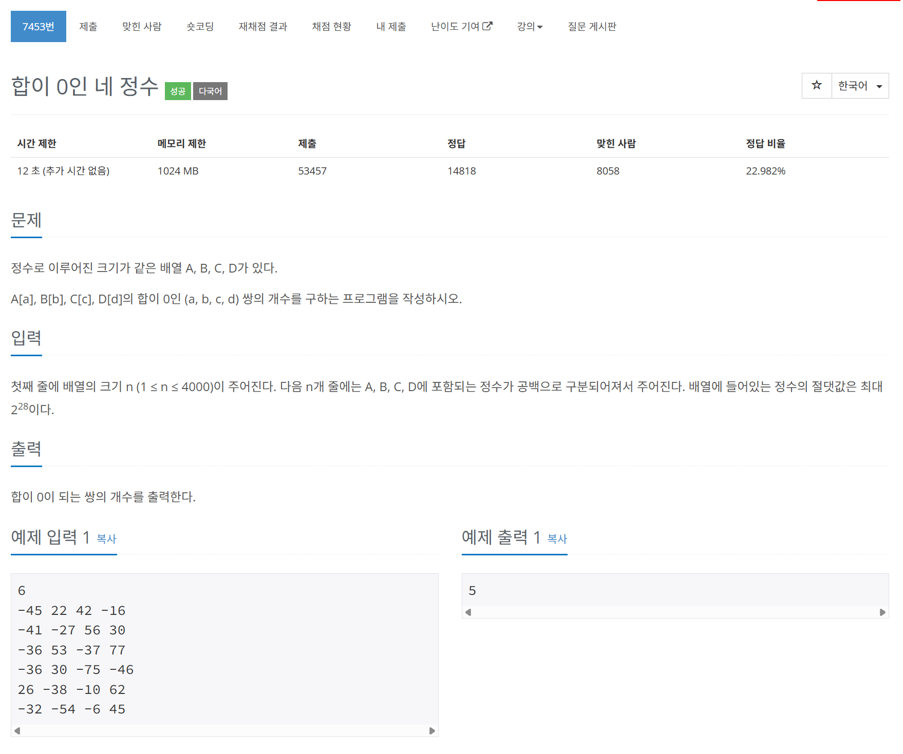

# 문제



# 코드
```
#include <iostream>
#include <vector>
#include <algorithm>

using namespace std;

int main()
{
  int N;
  cin >> N;
  vector<int> a(N, 0), b(N, 0), c(N, 0), d(N, 0);
  for (int i = 0; i < N; i++)
  {
    cin >> a[i] >> b[i] >> c[i] >> d[i];
  }
  vector<int> sum_ab, sum_cd;
  for (int i = 0; i < N; i++)
  {
    for (int j = 0; j < N; j++)
    {
      sum_ab.push_back(a[i] + b[j]);
      sum_cd.push_back(c[i] + d[j]);
    }
  }
  sort(sum_cd.begin(), sum_cd.end());
  unsigned long long zero_num = 0;
  for (int i = 0; i < N * N; i++)
  {
    if (lower_bound(sum_cd.begin(), sum_cd.end(), -sum_ab[i]) != sum_cd.end())
    {
      zero_num += (upper_bound(sum_cd.begin(), sum_cd.end(), -sum_ab[i]) - lower_bound(sum_cd.begin(), sum_cd.end(), -sum_ab[i]));
    }
  }
  cout << zero_num << "\n";
  return 0;
}
```

# 풀이 과정
meet in the middle 문제로  
가운데를 중심으로 두 문제로 분할하여 단순화하는 문제이다.  
두 개로 쪼갠 뒤 각각 더한 배열을 만들고 하나를 정렬하여  
이분 탐색으로 풀었다.